# خواننده تلگرام

<!-- TOP_NAV START -->

<a href="https://github.com/dannyfox-dx/aio-downloader/blob/main/telegram/content/archive_1.md" style="display:inline-block; padding:6px 12px; margin:0 4px; background-color:#2ea44f; color:white; text-decoration:none; border-radius:4px; font-weight:bold;">صفحه بعد</a>

<!-- TOP_NAV END -->

<!-- MSG START -->

---
📅 بروزرسانی: 1405/03/09 02:23
---

## VahidOOnLine — post 242841

♦️خبرگزاری تسنیم، وابسته به سپاه پاسداران، بامداد شنبه ۹ خرداد با انتشار تصاویری مدعی شد بقایای یک پهپاد متعلق به آمریکا و اسرائیل که در حوالی قشم هدف قرار گرفته، کشف شده است. تسنیم بیان کرد این پهپاد پس از شناسایی یک ریزپرنده در حوالی قشم، با واکنش پدافند هوایی ارتش هدف قرار گرفت و منهدم شد.
پیش از این، خبرنگار صدا و سیما در قشم نیز از فعال شدن سامانه پدافند هوایی در این منطقه خبر داده بود. هم‌زمان، خبرگزاری مهر به نقل از منابع محلی گزارش داد یک ریزپرنده در حوالی قشم از سوی پدافند هوایی هدف قرار گرفته و منهدم شده است.
‌🇸🇦 Indypersian

🤖 @VahidOOnLine

## VahidOOnLine — post 242840

  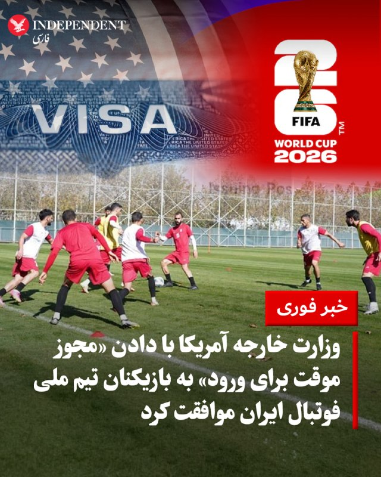

♦️دکتر جمشید ایرانی، وکیل دیوان عالی آمریکا، اطلاع دادند که وزارت خارجه ایالات متحده با دادن «مجوز موقت و مشروط برای ورود» (Parole) به بازیکنان تیم ملی فوتبال ایران موافقت کرده‌ است. این وکیل در نوشته‌ای که در صفحه فیسبوک خود به اشتراک گذاشت، با اشاره به تحقیق و پی بردن به تصمیم واشنگتن در قبال کاروان ورزشی ایران توضیح داد که وزارت امور خارجه آمریکا برای اعضای تیم ملی «ویزای معمولی» صادر نخواهد کرد، بلکه ورود آن‌ها به خاک این کشور در قالب این طرح مشروط خواهد بود که امتیازات ویزای عادی را ندارد. به گفته دکتر جمشید ایرانی، این مجوز تحت طبقه‌بندی «پی-۱» (P-1، ویژه ورزشکاران) صادر می‌شود که به دولت آمریکا اجازه می‌دهد در هر لحظه این امتیاز را لغو و افراد را بدون نیاز به حکم دادگاه اخراج کند؛ ضمن اینکه احتمال اعمال محدودیت مکانی ۴۰ کیلومتری (۲۵ مایلی) پیرامون ورزشگاه و نظارت ماموران ماموریت‌های مهاجرت و گمرک آمریکا (ICE) بر این کاروان وجود دارد.
پیش از این، درحالی‌که تنها ۱۲ روز تا آغاز جام جهانی ۲۰۲۶ باقی مانده و تیم ملی فوتبال ایران در اردوی آماده‌سازی به سر می‌برد، مهدی محمدنبی، سرپرست تیم ملی، پس از بازی مقابل گامبیا به خبرنگاران گفته بود که تا آن لحظه ویزای مکزیک و آمریکا «صادر نشده است». سرپرست تیم ملی فوتبال ایران با گلایه از این وضعیت اعلام کرده بود: «به فیفا ایمیل زدیم و پرسیدیم که چه روزی قرار است ویزا صادر شود. ما ویزای مولتی آمریکا و مکزیک را نیاز داریم. اینکه هنوز ویزای ما صادر نشده و همه از آن اطلاع دارند، عادلانه نیست».
‌🇸🇦 Indypersian

🤖 @VahidOOnLine

## VahidOOnLine — post 242839

  

♦️به گزارش خبرگزاری رویترز، فرانسیس داناوان، فرمانده ستاد جنوبی ارتش ایالات متحده، روز جمعه در اقدامی کم‌سابقه با مقامات ارشد نظامی کوبا در خط مرزی پایگاه دریایی گوانتانامو دیدار و گفتگو کرد. ارتش آمریکا اعلام کرد که در این ماموریت، مسائلی چون امنیت عملیاتی مرزها، حفاظت از نیروها و آمادگی رزمی پایگاه مورد بررسی قرار گرفته است.
این دیدار در شرایطی انجام می‌شود که تنش‌ها میان واشنگتن و هاوانا به شدت بالا گرفته است. دونالد ترامپ پیش از این اشاره کرده بود که پس از پایان موضوع ایران، تمرکز خود را بر تغییر حکومت در کوباخواهد گذاشت. دولت ترامپ با اعمال محاصره سوختی، فشار اقتصادی شدیدی را بر کوبا وارد کرده است؛ موضوعی که واکنش تند وزیر امور خارجه کوبا را به همراه داشت و هشدار داد که هرگونه اقدام نظامی آمریکا به یک «حمام خون» با هزاران کشته از هر دو طرف منجر خواهد شد.
‌🇸🇦 Indypersian

🤖 @VahidOOnLine

## VahidOOnLine — post 242838

♦️حسین علایی، فرمانده سابق نیروی دریایی سپاه پاسداران، در مصاحبه با «بر مدار ایران» گفت که پیش از آغاز جنگ اخیر، سناریوی ترور مقامات ارشد نظام را پیش‌بینی کرده و آن را با علی شمخانی، دبیر وقت شورای عالی امنیت ملی، در میان گذاشته بود. علایی گفت: «من سه روز قبل از جنگ جدید به شمخانی گفتم که نقشه اول آمریکا جنگ ۱۲ روزه و نقشه دوم آنها اعتراضات دی‌ماه بود، اما آنها اکنون روی نقشه سوم تمرکز کرده‌اند که استراتژی آن، هدف قرار دادن و ترور رهبر (علی خامنه‌ای) در همان نخستین روزهای آغاز جنگ است.» او در ادامه گفت که شمخانی در آن زمان با تکیه بر عدم توانایی دشمن در شناسایی موقعیت‌ها، این احتمال را رد کرده بود.
علی خامنه‌ای، دومین رهبر جمهوری اسلامی، و علی شمخانی، از مشاوران او، صبح ۹ اسفندماه در اولین روز جنگ، طی حمله مشترک آمریکا و اسرائیل کشته شدند.
‌🇸🇦 Indypersian

🤖 @VahidOOnLine

## VahidOOnLine — post 242837

  

به گزارش نیویورک‌پست، یکی از آخرین موارد اختلاف بر سر راه توافق احتمالی میان واشینگتن و تهران، چگونگی آزادسازی مرحله‌ای دارایی‌های ایران است که در قطر نگهداری می‌شود و برای اهداف بشردوستانه در نظر گرفته شده است.
بر اساس این گزارش، منابع مالی مورد بحث مستقیما در اختیار حکومت ایران قرار نخواهد گرفت، بلکه برای خرید مواد غذایی و تجهیزات پزشکی استفاده می‌شود و سپس این اقلام به ایران ارسال خواهد شد.
نیویورک‌پست به نقل از یک مقام دولت آمریکا نوشت پرداخت تدریجی این منابع به اجرای تعهدات از سوی ایران، از جمله بازگشایی تنگه هرمز و پاکسازی مین‌ها در تنگه هرمز، وابسته خواهد بود.

‌🏁 🇬🇧 IranintlTV

🤖 @VahidOOnLine

## VahidOOnLine — post 242836

  

♦️«ان‌بی‌سی نیوز» به نقل از منابع آگاه، روز جمعه گزارش داد، ارتش ایالات متحده علی‌رغم جستجوهای گسترده و مداوم در آبراه حیاتی تنگه هرمز، هنوز نتوانسته است ادعای مین‌گذاری رژیم ایران در این منطقه را به طور قطعی تایید کند. دو مقام رسمی آمریکا و یک فرد مطلع از این پرونده اعلام کرده‌اند که با وجود ارزیابی‌های اولیه اطلاعاتی مبنی بر اقدام حکومت ایران به مین‌گذاری در بخش جنوبی این تنگه در آغاز جنگ در ماه فوریه، بازرسی‌های مکرر با استفاده از پهپادهای زیرسطحی، ربات‌های آبی و پرنده‌های سرنشین‌دار و بدون سرنشین هنوز به کشف هیچ مین مشخصی منجر نشده است؛ موضوعی که بر ابهامات و سردرگمی‌های موجود پیرامون این نبرد افزوده است.
بر اساس این گزارش، عدم دستیابی به شواهد قطعی در آستانه ورود این جنگ به چهارمین ماه خود، سوالات کلیدی را درباره میزان «جدی و مستحکم بودن» این تهدیدات برانگیخته است. این در حالی است که دونالد ترامپ و مقامات ارشد دولت او پیش از این بارها گفته بودند که ایران ممکن است در حال پر کردن تنگه با مین‌های دریایی باشد؛ مطلبی که به عنوان دلیل اصلی توقف تردد کشتی‌ها و جهش بی‌سابقه قیمت نفت مطرح می‌شد. با این حال، کارشناسان تاکید می‌کنند که مین‌گذاری موثر این آبراه حیاتی مستلزم به‌کارگیری حجم بسیار بالایی از مواد منفجره پنهان در یک منطقه مشخص است که ارتش آمریکا هنوز نشانه‌ای از آن پیدا نکرده است.
‌🇸🇦 Indypersian

🤖 @VahidOOnLine

## VahidOOnLine — post 242835

  

♦️یک منبع رسمی ایرانی در گفتگو با خبرنگار الجزیره، با اشاره به روند مذاکرات و توافق موقت با ایالات متحده آمریکا اعلام کرد که «با تیمی که فاقد هرگونه چارچوب حرفه‌ای یا اخلاقیِ پایدار است، بر اساس روحیات و خلق‌وخوی شخصی رفتار می‌کند و خواسته‌های خود را به طور مداوم تغییر می‌دهد، نمی‌توان هیچ چیز را نهایی‌شده توصیف کرد.»
‌🇸🇦 Indypersian

🤖 @VahidOOnLine

## WithYashar — post 12921

  <a href="telegram/content/WithYashar_12921_1780095236.mp4" target="_blank">🎬 Download video</a>

گلزار: نماز میخونم و شبا هم هر موقع بیدار شم شروع میکنم به دعا کردن
@withyashar 🥶

## WithYashar — post 12920

یک مقام کاخ سفید در گفت‌و‌گو با خبرنگار شبکۀ الجزیره مدعی شد: دونالد ترامپ هیچ توافقی را امضا نخواهد کرد مگر آنکه این توافق مطالبات آمریکا را تأمین کرده و با خطوط قرمز تعیین‌شده از سوی او همخوانی داشته باشد.
«واشنگتن هرگز اجازه نخواهد داد ایران به سلاح هسته‌ای دست پیدا کند».
@withyashar

## WithYashar — post 12918

@withyashar وضعیت

## WithYashar — post 12916

اسرائیل هیوم: مقام‌های موساد معتقدند عملیات‌های اخیر علیه ایران فقط یک مرحله در مسیر سقوط جمهوری اسلامی بوده است. رئیس پیشین شاخه نفوذ گفت این واحد اکنون با شدت بیشتری فعالیت می‌کند و هدف آن «سریع‌تر کردن ساعت شنی پایان حکومت است».
@withyashar

## WithYashar — post 12915

https://t.me/boost/withyashar

بچه‌ها عالی بود👏👏، بوست ۳۴۸ تا دیگه لازم داره. لطفاً این پیام رو برای تمام دوستانتون که تلگرام پرمیوم(تیک) دارن بفرستین و ازشون خواهش کنین که چنل رو بوست کنن ❤️‍🩹چیزی‌ تا ایموجی نمونده🤰🫃🏻

## WithYashar — post 12914

شکست مذاکرات پنتاگون؛ اصرار تل‌آویو بر تداوم جنگ در لبنان

منبع رسمی لبنانی: طرف اسرائیلی با درخواست هیئت لبنانی برای آتش بس مخالفت کرد

یک منبع رسمی لبنانی در گفت‌وگو با المیادین اعلام کرد:  هیئت نظامی مذاکره‌کننده در پنتاگون، به درخواست خود برای برقراری آتش‌بس واقعی دست نیافت. این هیئت بر مطالبه آتش‌بس پافشاری کرد، اما با مخالفت مکرر اسرائیل مواجه شد.

به گفته این منبع، هیئت اسرائیلی از عقب‌نشینی از اراضی اشغالی لبنان خودداری کرده و بر «نابودی (توانمندی‌های نظامی) حزب الله» اصرار کرد.
@withyashar

## mwarmonitor — post 9906

🔴ترامپ ملزم به پاسخگویی درباره «اتهامات سنگین» در پرونده آی‌آر‌اس (سازمان امور مالیاتی) شد

📝نویسنده: آیوری لاتز AXIOS

🔸یک قاضی فدرال به پرزیدنت ترامپ دستور داد تا به اتهامات «سنگین» مطرح شده پاسخ دهد؛ اتهاماتی که ادعا می‌کنند توافق او با سازمان امور مالیاتی (IRS) — که منجر به ایجاد صندوق مبارزه با استفاده ابزاری از نهادها (anti-weaponization fund) شد — «بر پایه فریبکاری» بوده است.

📌چرا این موضوع اهمیت دارد؟
این دستور درست در همان روزی صادر شد که قاضی دیگری موقتاً این صندوق مالی ۱.۷۷۶ میلیارد دلاری را مسدود کرد؛ اقدامی که مانع بالقوه دیگری بر سر راه طرح توافق جنجالی دولت ترامپ ایجاد می‌کند.

🔸پشت صحنه ماجرا (محور اخبار):
دستور قاضی دادگاه منطقه‌ای ایالات متحده، کاتلین ویلیامز، در پی درخواست قبلی ۳۵ قاضی سابق فدرال صادر شد. این قضات از او خواسته بودند پرونده‌ای را که در ماه ژانویه در رابطه با لو رفتن اظهارنامه‌های مالیاتی ترامپ تشکیل شده بود، دوباره باز کند.

@mwarmonitor

## mwarmonitor — post 9905

🔴رهبران سه سازمان اقتصادی بین‌المللی روز جمعه هشدار دادند که اگر حمل‌ونقل نفت به حالت عادی بازنگردد، ممکن است با افزایش «ریسک برای امنیت سوخت، شرایط بازار و تاب‌آوری گسترده‌تر اقتصاد» مواجه شویم؛ به‌ویژه زمانی که تقاضا در تابستان افزایش پیدا کند. CBS

@mwarmonitor

## mwarmonitor — post 9904

🔴ایران و مسیر پیش‌رو: ترامپ باید از اهرم فشار خود استفاده کند و به دنبال «صلح از طریق قدرت» باشد

📝 نویسنده: ربکا ال. هاینریش ، انستیتو هادسون

🔸عملیات‌های «پتک نیمه‌شب» (Midnight Hammer) و «خشم حماسی» (Epic Fury) با موفقیت برنامه‌ تسلیحات هسته‌ای و قدرت‌نمایی منطقه‌ای ایران را تضعیف کردند. ایالات متحده و اسرائیل توان نظامیِ نیروی دریایی و هوایی ایران را به شدت کاهش دادند و در عین حال، به ارکان اصلی پایه صنعتی دفاعی آن، به‌ویژه تولید فولاد و پلاستیک مرتبط با صنایع نظامی، آسیب سنگینی وارد کردند. عملیات‌های نظامی متحدان همچنین باعث ایجاد شکاف در درون رژیم ایران شده است؛ از جمله فروپاشی در ساختار فرماندهی و کنترل که به نظر می‌رسد توانایی چهره‌های سیاسی را برای کنترل عملیات‌های سپاه پاسداران انقلاب اسلامی در تنگه هرمز تحت تأثیر قرار داده است.

اگرچه ایالات متحده و اسرائیل رژیم را تضعیف کرده‌اند، اما واشنگتن در مذاکرات با یک مانع روبرو است؛ زیرا مشخص نیست چه کسی در تهران قدرت را در دست دارد و آیا نمایندگان سیاسی ایران می‌توانند تعهدات خود را بر سپاه پاسداران تحمیل و اجرا کنند یا خیر. مسئله اصلی صرفاً دستیابی به یک توافق نیست، بلکه پایداری و دوام هرگونه توافق است. این چالش پابرجا خواهد ماند زیرا رژیم از درون دچار چنددستگی است، جمهوری اسلامی سابقه‌ای طولانی در عدم حسن نیت در مذاکرات دارد و همچنان حاضر نیست از ادعای نادرست خود مبنی بر «حق غنی‌سازی اورانیوم» دست بکشد.
اگر ایالات متحده موفق شود یک یادداشت تفاهم از بقایای رژیم ایران (حتی با وجود رهبری متفرق فعلی) دریافت کند، باید از ایرانی‌ها بخواهد که توقف واقعی تجاوزات در تنگه هرمز و رویکردی تعاملی برای برچیدن سایر عناصر برنامه تسلیحات هسته‌ای خود را نشان دهند. دولت ترامپ متعهد شده است تا زمانی که ایران ابتدا پایبندی خود را به یک تنگه آزاد و باز نشان نداده و برنامه هسته‌ای خود را برچیند، هیچ توافقی را نخواهد پذیرفت و فشار اقتصادی یا نظامی را کاهش نخواهد داد.
دستاوردهای نظامی و آسیب‌پذیری‌ها
عملیات «خشم حماسی» با موفقیت ساختارهای فرماندهی و کنترل و رهبران کلیدی نظامی ایران را مختل کرد و توانمندی‌های متعارف کلیدی آن را کاهش داد. اما این عملیات تا مرز نابودی کامل تشکیلات سپاه پاسداران پیش نرفت. واحدهای سپاه در امتداد سواحل خلیج [فارس] هنوز می‌توانند با خودمختاری قابل‌توجهی عمل کنند، قایق‌های تندرو را مستقر کنند، پرتابگرها را به کار بگیرند، به سمت هواپیماهای آمریکایی که محاصره کشتیرانی ایران را اجرا می‌کنند موشک‌های زمین به هوا شلیک کنند و حتی در شرایطی که مقامات سیاسی ایران در حال مذاکره هستند، مزاحم کشتیرانی بین‌المللی شوند.
این ازهم‌گسیختگی یک مشکل اساسی برای دیپلماسی ایجاد می‌کند: رهبری سیاسی تهران ممکن است تضمین‌هایی بدهد که توانایی اجرای آن‌ها را ندارد. ادامه فعالیت‌های سپاه در تنگه هرمز در طول مذاکرات، این سوال عمیق‌تر را برجسته می‌کند که آیا اصلاً کسی در تهران هست که بتواند به طور قابل اعتمادی سپاه را مجبور به پایبندی به یک توافق کند؟
تنگه هرمز: یک اهرم فشار، نه منوط به اجازه
تضمین آزادی کشتیرانی در تنگه هرمز یک اولویت فوری و کوتاه‌مدت است، زیرا اختلال در آنجا بر بازارهای جهانی، به‌ویژه در حوزه انرژی و ثبات اقتصادی تأثیر می‌گذارد. اما ایالات متحده باید از هرگونه چارچوبی که مستلزم مذاکره برای کسب مجوزهای گام‌به‌گام از ایران باشد یا کنترل باقی‌مانده بر این آبراه حیاتی جهانی را در دست تهران باقی بگذارد، خودداری کند.
هرگونه توافقی که در ازای همکاری محدود ایران در زمینه کشتیرانی، تحریم‌ها را کاهش دهد یا بخش‌هایی از محاصره را لغو کند، خطر از دست رفتن اهرم فشاری را به همراه دارد که برای برچیدن دائمی برنامه هسته‌ای ایران نیاز است. رویکرد مؤثرتر، از سرگیری «پروژه آزادی» (Project Freedom) خواهد بود. این پروژه شامل پاکسازی تهدیدها در طول تنگه، خنثی کردن قایق‌های تندرو سپاه، سایت‌های موشکی ساحلی و سیستم‌های مستقر در غارها، و اسکورت ترافیک تجاری از طریق این آبراه است، به جای اینکه منتظر اجازه ایران بمانند. شرکت‌های بیمه و خطوط کشتیرانی تا زمانی که واحدهای سپاه به فعالیت خود در طول خط ساحلی ادامه می‌دهند، بعید است تنها به تضمین‌های سیاسی اعتماد کنند.



@mwarmonitor

## FoxNewsTwitter — post 342414

  

Fox News (Twitter/X)

A former mayor pleaded guilty Friday to acting as an illegal agent of the Chinese government.

Eileen Li Wang, the former mayor of Arcadia, California, allegedly acted "at the direction and control" of Chinese government officials between 2020 and 2022, without notifying U.S. authorities, prior to taking office.

According to court documents, Wang worked alongside a convicted Chinese agent, who is already serving a four-year federal prison sentence, to operate a website posing as a local Chinese-American news outlet.

Prosecutors described the website as a propaganda arm for the Chinese Communist Party that published content supplied directly by Chinese government officials.

She faces up to 10 years in prison. The judge has scheduled sentencing for October 6, 2026.

## VahidOnline — post 75798

  <a href="telegram/content/VahidOnline_75798_1780095239.mp4" target="_blank">🎬 Download video</a>

خبرگزاری تسنیم، وابسته به سپاه پاسداران، بامداد شنبه ۹ خرداد با انتشار تصاویری مدعی شد بقایای یک پهپاد متعلق به آمریکا و اسرائیل که در حوالی قشم هدف قرار گرفته، کشف شده است.
تسنیم بیان کرد این پهپاد با واکنش پدافند هوایی ارتش هدف قرار گرفت و منهدم شد.
پیش از این خبرگزاری مهر به نقل از منابع محلی گزارش داد یک ریزپرنده در حوالی قشم از سوی پدافند هوایی هدف قرار گرفته و منهدم شده است.
@VahidOOnLine

📡 @VahidOnline

## VahidOnline — post 75797

  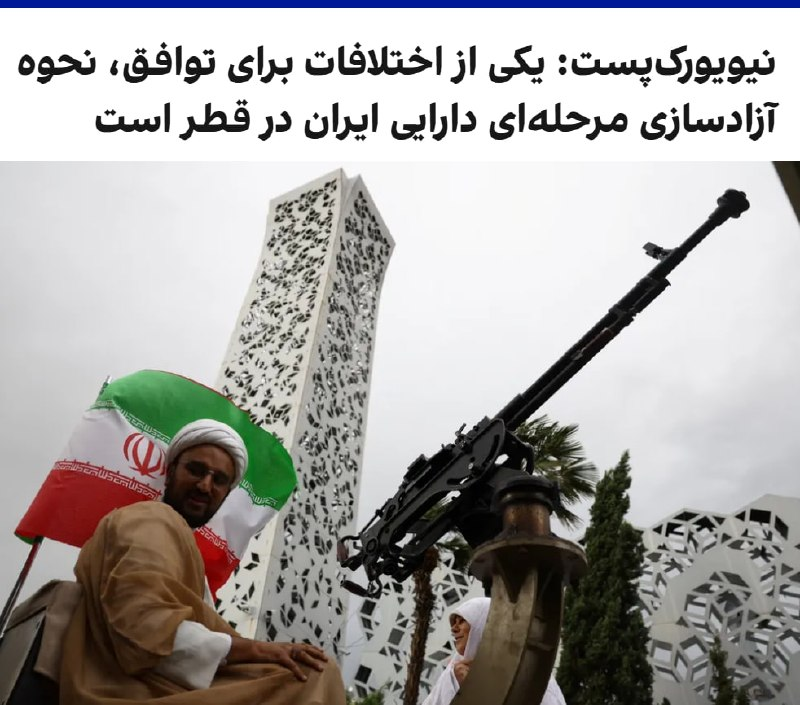

به گزارش نیویورک‌پست، یکی از آخرین موارد اختلاف بر سر راه توافق احتمالی میان واشینگتن و تهران، چگونگی آزادسازی مرحله‌ای دارایی‌های ایران است که در قطر نگهداری می‌شود و برای اهداف بشردوستانه در نظر گرفته شده است.

بر اساس این گزارش، منابع مالی مورد بحث مستقیما در اختیار حکومت ایران قرار نخواهد گرفت، بلکه برای خرید مواد غذایی و تجهیزات پزشکی استفاده می‌شود و سپس این اقلام به ایران ارسال خواهد شد.

نیویورک‌پست به نقل از یک مقام دولت آمریکا نوشت پرداخت تدریجی این منابع به اجرای تعهدات از سوی ایران، از جمله بازگشایی تنگه هرمز و پاکسازی مین‌ها در تنگه هرمز، وابسته خواهد بود.
@VahidOOnLine

📡 @VahidOnline

## IranIntlTV — post 339661

  <a href="telegram/content/IranIntlTV_339661_1780095240.mp4" target="_blank">🎬 Download video</a>

یک زن سرپرست خانوار با ارسال پیامی به ایران اینترنشنال می‌گوید که به دلیل افزایش قیمت‌ها و اجاره خانه توان تامین معاش خود و خانواده را ندارد. صدای او برای حفظ امنیتش تغییر داده شده است.

## IranIntlTV — post 339660

  

به گزارش نیویورک‌پست، یکی از آخرین موارد اختلاف بر سر راه توافق احتمالی میان واشینگتن و تهران، چگونگی آزادسازی مرحله‌ای دارایی‌های ایران است که در قطر نگهداری می‌شود و برای اهداف بشردوستانه در نظر گرفته شده است.
بر اساس این گزارش، منابع مالی مورد بحث مستقیما در اختیار حکومت ایران قرار نخواهد گرفت، بلکه برای خرید مواد غذایی و تجهیزات پزشکی استفاده می‌شود و سپس این اقلام به ایران ارسال خواهد شد.
نیویورک‌پست به نقل از یک مقام دولت آمریکا نوشت پرداخت تدریجی این منابع به اجرای تعهدات از سوی ایران، از جمله بازگشایی تنگه هرمز و پاکسازی مین‌ها در تنگه هرمز، وابسته خواهد بود.

https://iranintl.com/202605292135

## Shin_Persian — post 6314

  <a href="telegram/content/Shin_Persian_6314_1780095243.mp4" target="_blank">🎬 Download video</a>

Shin ✓ @hey_itsmyturn
Fri, 29 May 2026 22:26:44 UTC

Reported video of a UAV wreckage in Qeshm island
Hormozgan Province, #Iran
Source: IRIB on TG

فارسی

ویدئوی منتشر شده از لاشه یک پهپاد در جزیره قشم
استان هرمزگان، #Iran
منبع: صدا و سیما در تلگرام

𝕏 · @shin_persian

## FarsiVOA — post 219031

  

⚡️ستاد فرماندهی جنوبی آمریکا اعلام کرد که ژنرال فرانسیس داناون، فرمانده ارشد ناظر بر نیروهای ایالات متحده در آمریکای لاتین، روز جمعه با مقامات ارشد نظامی کوبا در حاشیه پایگاه دریایی آمریکا در خلیج گوانتانامو در کوبا دیدار و گفت‌وگو کرد.
@FarsiVOA

## FarsiVOA — post 219030

🔺روبیو در تماس تلفنی با جوزف عون: حزب الله تلاش‌ می‌کند با به خطر انداختن جان مردم لبنان مذاکرات با اسرائيل را از مسیر خارج کند

▪️وزارت امور خارجه آمریکا، روز جمعه، ۸ خردادماه، از گفت‌وگوی تلفنی مارکو روبیو، وزیر امور خارجه ایالات متحده با جوزف عون، رئیس‌جمهوری لبنان خبر داد.

⬇️ بیشتر بخوانید:
https://ir.voanews.com/a/8155376.html
@FarsiVOA

## Persian_Trend_Official — post 15304

  <a href="telegram/content/Persian_Trend_Official_15304_1780095246.mp4" target="_blank">🎬 Download video</a>

شبتون بخیر 🌃

Mig-25 Foxbat vs F-15 Eagle

📌 @persian_trend_official
پرشین ترند | متفاوت‌ترین کانال نظامی

## Persian_Trend_Official — post 15303

https://youtube.com/live/24Mc1cJMDgQ?feature=share

## IranianMinds — post 21051

🔴 یک قاضی فدرال حکم داد که نام ترامپ باید از مرکز هنرهای نمایشی جان اف کندی حذف شود. این دادگاه اعلام کرد که نام این مجموعه را نمی‌توان بدون تایید رسمی کنگره تغییر داد.

کریستوفر کوپر، قاضی منطقه‌ای ایالات متحده، به دولت ترامپ دستور داد تا ظرف ۱۴ روز آینده، تمامی تابلوهای حاوی نام ترامپ را جمع‌آوری کرده و عبارت «مرکز کندی ترامپ» را از تمامی اسناد و مکاتبات رسمی حذف کنه

ترامپ هم فشاری شده از این سمت اومده 518 خط متن نوشته و داره فحشش میده :))

@IranianMinds

## IranianMinds — post 21050

هر وقت این بیانیات قبل جنگ حضرت عاقارو میبینم واقعا دلم میگیره , خودشم میدونست چخبره 💔

@IranianMinds

## IranianMinds — post 21049

دیگه قرار نیست این صدارو بشنویم 😭

@IranianMinds

## IranianMinds — post 21048

یادش بخیر 91 روز پیش موشو پدرو کشتن @IranianMinds

## IranianMinds — post 21047

یادش بخیر 91 روز پیش موشو پدرو کشتن

@IranianMinds

## BBCPersian — post 282355

  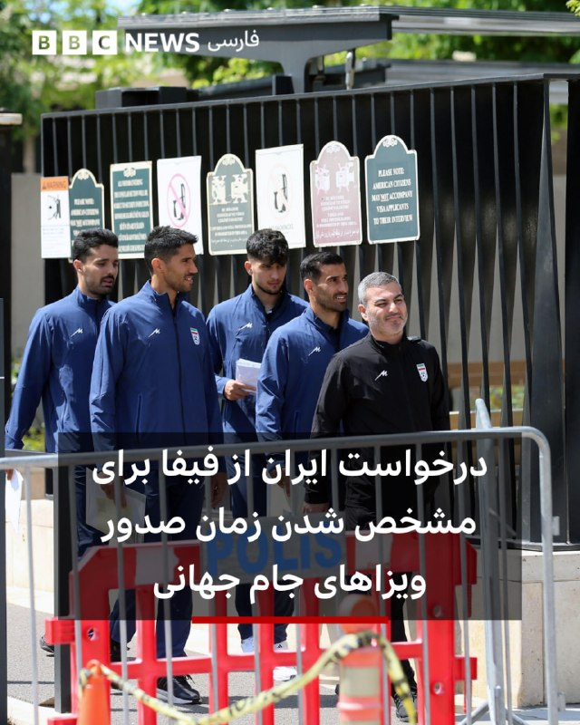

‌ ‌ ‌ ‌
مقام‌های فدراسیون فوتبال ایران اعلام کردند که پس از انتقال اردوی تیم ملی برای جام جهانی از آریزونا به شهر تیخوانا در مکزیک، از فیفا خواسته‌اند تا زمان صدور ویزاهای این رقابت‌ها را مشخص کند.

تیم ملی ایران روز جمعه در دیداری تدارکاتی در شهر آنتالیا ترکیه با نتیجه سه بر یک، گامبیا را شکست داد.

ایران قرار است که هر سه مسابقه خود در مرحله گروهی جام جهانی را در آمریکا برگزار کند، اما از زمان حملات آمریکا و اسرائیل به ایران در اواخر فوریه، ابهام‌هایی درباره حضور این تیم در مسابقات به وجود آمده است.

به گفته مقام‌های فدراسیون فوتبال ایران، انتقال اردو به تیخوانا به‌دلیل مشکلات دیپلماتیک و مسائل مربوط به ویزا انجام شده و اکنون تیم ملی برای حضور در مسابقات خود در لس‌آنجلس و سیاتل، علاوه بر ویزای آمریکا، به مجوزهای تردد میان مکزیک و آمریکا نیز نیاز دارد.

مهدی محمدنبی، نایب‌رئیس اول فدراسیون فوتبال ایران، به رویترز گفت: «امروز برای فیفا ایمیل فرستادیم و خواستیم هرچه زودتر نتیجه را اعلام کند و بگوید که ویزاها در چه تاریخی صادر خواهند شد.»

https://bbc.in/4u8Us7o
📷 EPA/Shutterstock
@BBCPersian

## BBCPersian — post 282354

  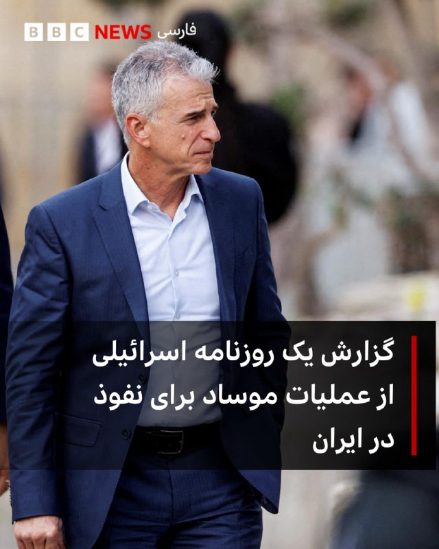

‌ ‌ ‌ ‌
روزنامه «اسرائیل هیوم» چاپ تل‌آویو گزارشی منتشر کرده است از عملیات پیچیده موساد برای نفوذ در ایران و برانداختن حکومت جمهوری اسلامی. در این گزارش به نقل از منابعی در موساد، از جمله یک مقام ارشد که تا حدود سه ماه پیش رئیس شاخه نفوذ این سازمان بود، جزئیات منتشر شده در این گزارش بسیار کم سابقه است.

در این گزارش آمده است که داوید برنع وقتی در ژوئن سال ۲۰۲۱ ریاست موساد را به عهده گرفت، تغییراتی در رویکرد و ساختار این سازمان ایجاد کرد.

یکی از این تغییرات، که با مقاومت درونی زیادی هم روبرو شد، تجدید ساختار واحد اطلاعات انسانی موساد، معروف به زومت (Tzomet) بود.

https://bbc.in/49wmP8a
📷Reuters
@BBCPersian

## Dirty_Kids — post 390536

  <a href="telegram/content/Dirty_Kids_390536_1780095250.webm" target="_blank">🎬 Download video</a>

☢️خفن ترین و‌ قدیمی ترین  انالیزور  ایران ینی دکتر بت 
👍 
🔴مسابقات جذاب جام جهانی به زودی شروع میشه بیا توی کانال دکتر بت و باهاش همراه شو و پول در بیار
💵 رایگان بهترین شرط هارو براتون میذاره حتی هزار تومن هم دریافت نمیکنه روزانه میتونی از پیش بینی فوتبال باهاش…

## Dirty_Kids — post 390535

  <a href="telegram/content/Dirty_Kids_390535_1780095251.webm" target="_blank">🎬 Download video</a>

☢️خفن ترین و‌ قدیمی ترین  انالیزور  ایران ینی دکتر بت 
👍

🔴مسابقات جذاب جام جهانی به زودی شروع میشه بیا توی کانال دکتر بت و باهاش همراه شو و پول در بیار
💵

رایگان بهترین شرط هارو براتون میذاره
حتی هزار تومن هم دریافت نمیکنه
روزانه میتونی از پیش بینی فوتبال باهاش پول در بیاری 👌
A8

🌟اگ اهل پیش بینی فوتبالی این کانال اصلا از دست ندین
👇

✅https://t.me/+4_ADqwB9e-QwYjlk

✅https://t.me/+4_ADqwB9e-QwYjlk

## Dirty_Kids — post 390534

  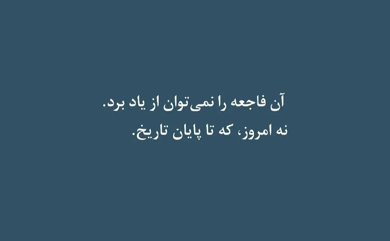

#بخوابیم

@Dirty_Kids 👻

## Dirty_Kids — post 390530

  <a href="telegram/content/Dirty_Kids_390530_1780095252.mp4" target="_blank">🎬 Download video</a>

جفت کنید، اینا 👆۲۰ میلیارد ناقابل دادن فقط برای عروسی گرفتن😕

۹۰ درصد مردم تمام آرزوشون ۲۰ میلیارده یه خونه و ماشین بگیرن، این دیگه اختلاف طبقاتی نیست شیاف طبقاتیه

@Dirty_Kids 👻

## Dirty_Kids — post 390529

  <a href="telegram/content/Dirty_Kids_390529_1780095253.mp4" target="_blank">🎬 Download video</a>

از اول جنگ تا حالا ۱۶بار نتانیاهو رو کشتن 😂😂

یعنی اول بچه‌شیعه بوده بعد کصخلا و کونی‌پرو‌ها از روش یاد گرفتن کصخلیت و کونی‌‌پروگریو

@Dirty_Kids 👻

## Dirty_Kids — post 390528

  <a href="telegram/content/Dirty_Kids_390528_1780095254.mp4" target="_blank">🎬 Download video</a>

حاجی قبلن شهریاری ویدیو رقصش تو عروسی درمیومد ممنوع صحنه میشد

ببینید اثرات موشک بی‌بی‌ و ترامپو

چقد تخمیه این دختره

@Dirty_Kids 👻

## Dirty_Kids — post 390527

اون پولی که بابت فیلتر شکن دادی چوب زوری بوده که جمهوری اسلامی تو کونت کرده، با چوب تو کونتم فلکس میکنی عقب مونده؟

@Dirty_Kids 👻

## Dirty_Kids — post 390525

  <a href="telegram/content/Dirty_Kids_390525_1780095257.mp4" target="_blank">🎬 Download video</a>

🔴 این ویدیو ها مربوط به شبی هست که خامنه‌ای کشته شد، مردم کِل میکشن و پایکوبی میکنن.

@Dirty_Kids 👻

## alonews — post 123591

  

🚀همراه با ساب + حجم مصرفی برای استفاده طولانی‌تر و بهینه‌تر 😍

@NetAazaadBot
@NetAazaadBot

⚡️ سرعت واقعی بدون افت
🛡 اتصال پایدار و بدون قطعی
🚀 مناسب گیم، دانلود و استفاده روزانه

@NetAazaadBot
@NetAazaadBot

💎 گیگی فقط 19T
📩 برای خرید استارت بزن و سریع وصل شو 🚀

## alonews — post 123590

  <a href="telegram/content/alonews_123590_1780095258.webm" target="_blank">🎬 Download video</a>

👈شورای امنیت سازمان ملل متحد در گزارشی تازه از افزایش خشونت‌های جنسی، تجاوز گروهی، شکنجه و رفتارهای تحقیر‌آمیز علیه زنان و دختران در افغانستان پرده برداشت و مقام‌ها و نیروهای وابسته به طالبان را مسئول بخش عمده این موارد دانست.

✅ @AloNews خبر جنگ

## alonews — post 123589

  <a href="telegram/content/alonews_123589_1780095258.webm" target="_blank">🎬 Download video</a>

👈وضعیت مردم ایران

✅ @AloNews خبر جنگ

## alonews — post 123588

  <a href="telegram/content/alonews_123588_1780095258.webm" target="_blank">🎬 Download video</a>

👈فردی که در تصویر می‌بینید به گزارش روزنامه فایننشیال تایمز مالک شبکه ایران اینترنشنال است! 
✅ @AloNews خبر جنگ

---
📅 بروزرسانی: 1405/03/09 01:00
---

## VahidOOnLine — post 242834

  

♦️به گزارش روزنامه نیویورک‌پست، یکی از آخرین موانع باقی‌مانده در مسیر توافق صلح موقت میان آمریکا و جمهوری اسلامی ایران، نحوه آزادسازی مرحله‌به‌مرحله ۶ میلیارد دلار از دارایی‌های ایران در قطر است. دونالد ترامپ و مذاکره‌کنندگان ایرانی در حال چانه‌زنی بر سر جزئیات نهایی یک تفاهم‌نامه هستند که بر اساس آن، تنگه هرمز به روی کشتیرانی بین‌المللی بازگشایی می‌شود و در مقابل، زمان بیشتری برای دور دوم مذاکرات درباره سرنوشت اورانیوم غنی‌شده ایران داده خواهد شد. این اموال مستقیما به ایران پرداخت نمی‌شود بلکه برای خرید غذا و دارو هزینه خواهد شد و آزادسازی تدریجی آن به پایبندی ایران به تعهداتی چون بازگشایی و مین‌روبی تنگه هرمز مشروط است.
نیویورک‌پست به نقل از یک مقام مسئول افزود که این نزدیک‌ترین وضعیت دو کشور به توافق است؛ با این حال، روند صلح به دلیل پنهان شدن مجتبی خامنه‌ای، رهبر جمهوری اسلامی، از ترس ترور توسط آمریکا و اسرائیل و نیاز به فرآیند چندروزه تبادل پیام از طریق پیک، با کندی پیش می‌رود.
‌🇸🇦 Indypersian

🤖 @VahidOOnLine

## VahidOOnLine — post 242833

  

♦️درحالی‌که تنها ۱۲ روز تا آغاز جام جهانی ۲۰۲۶ باقی مانده و تیم ملی فوتبال ایران در اردوی آماده‌سازی به سر می‌برد، مهدی محمدنبی، سرپرست تیم ملی، پس از بازی مقابل گامبیا به خبرنگاران گفت که تا این لحظه ویزای مکزیک و آمریکا «صادر نشده است». او گفت: «به فیفا ایمیل زدیم و پرسیدیم که چه روزی قرار است ویزا صادر شود. ما ویزای مولتی آمریکا و مکزیک را نیاز داریم. اینکه هنوز ویزای ما صادر نشده و همه از آن اطلاع دارند، عادلانه نیست».
‌🇸🇦 Indypersian

🤖 @VahidOOnLine

## VahidOOnLine — post 242832

♦️اسکات بسنت، وزیر خزانه‌داری ایالات متحده، روز جمعه هشتم خرداد در «مجمع اقتصادی ملی ریگان» اعلام کرد که واشنگتن حدود یک میلیارد دلار از دارایی‌های رمزارزی مرتبط با حکومت ایران را به طور مستقیم توقیف و کیف‌پول‌های دیجیتال آن‌ها را ضبط کرده است. او با تاکید بر اینکه این اموال در واقع پول‌های دزدیده‌شده از مردم ایران است، اشاره کرد که بسیاری از صاحبان این حساب‌ها هنوز متوجه ضبط دارایی و کیف‌پول دیجیتال خود نشده‌اند.
وزیر خزانه‌داری آمریکا همچنین افزود واشنگتن با همکاری نزدیک متحدان اروپایی خود در حال ردیابی و توقیف املاک و مستغلات، از جمله ویلاها و خانه‌های متعلق به این افراد در سراسر اروپا است.
‌🇸🇦 Indypersian

🤖 @VahidOOnLine

## VahidOOnLine — post 242831

  

♦️وزارت خزانه‌داری ایالات متحده، روز جمعه، در ادامه کارزار فشار حداکثری علیه جمهوری اسلامی تحت عنوان طرح «خشم اقتصادی»، از وضع تحریم‌های جدید ضد تروریستی علیه شبکه تدارکاتی و مالی مرتبط با تهران خبر داد؛ بر اساس بیانیه رسمی این وزارتخانه، ۸ فرد و ۵ نهاد به دلیل کلاهبرداری، جعل هویت شرکت‌های آمریکایی و دور زدن تحریم‌ها برای تامین قطعات و نرم‌افزارهای امنیتی مورد نیاز وزارت دفاع ایران و سپاه پاسداران در فهرست سیاه قرار گرفته‌اند. این تحریم‌ها عمدتا شبکه‌ای مرتبط با علی مجد سپهر و برخی شرکت‌های وابسته به وزارت دفاع و پشتیبانی نیروهای مسلح جمهوری اسلامی را هدف قرار داده است. وزارت خزانه‌داری آمریکا در این بیانیه اعلام کرد علی مجد سپهر، محمدعلی منصور دره‌شیری، سعید زاهدی، پیام اختریان، هدی باقری، فرزانه رضایی، رودابه سرمدی و منوچهر زندیان هشت فرد تحریم شده هستند. واشنگتن هم‌زمان با مسدود کردن دارایی‌های رمزارزی مرتبط با تهران، به شرکت‌های بین‌المللی و پالایشگاه‌های مستقل در خصوص هرگونه تسهیل تجاری یا پرداخت عوارض عبور به ایران در تنگه هرمز هشدار داده و تأکید کرده است که متخلفان با تحریم‌های ثانویه سنگین روبرو خواهند شد.
‌🇸🇦 Indypersian

🤖 @VahidOOnLine

## VahidOOnLine — post 242830

  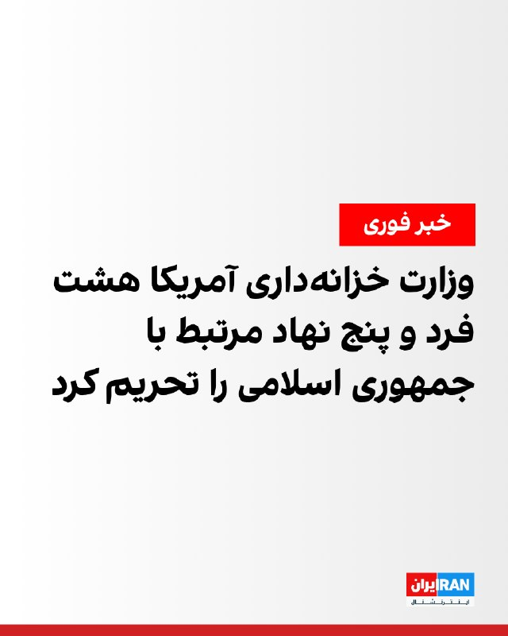

وزارت خزانه‌داری آمریکا جمعه تحریم‌های جدیدی در چارچوب مقابله با تروریسم علیه شماری از افراد و نهادهای ایرانی و همچنین برخی اشخاص و شرکت‌های دیگر اعمال کرد.

بر اساس اعلام وزارت خزانه‌داری آمریکا هشت فرد و پنج نهاد را به فهرست تحریم‌های خود افزود. این تحریم‌ها عمدتا شبکه‌ای مرتبط با علی مجد سپهر و برخی شرکت‌های وابسته به وزارت دفاع و پشتیبانی نیروهای مسلح جمهوری اسلامی را هدف قرار داده است.

وزارت خزانه‌داری آمریکا افزود علی مجد سپهر، محمدعلی منصور دره‌شیری، سعید زاهدی، پیام اختریان، هدی باقری، فرزانه رضایی، رودابه سرمدی و منوچهر زندیان هشت فرد تحریم شده هستند.
‌🏁 🇬🇧 IranintlTV

🤖 @VahidOOnLine

## VahidOOnLine — post 242829

  

♦️«نهاد مدیریت آبراهه خلیج فارس» (PGSA) روز جمعه، هشتم خردادماه، با انتشار بیانیه‌ای در حساب رسمی خود در اکس، تحریم‌های اخیر وزارت خزانه‌داری آمریکا علیه این نهاد را به شدت محکوم کرد و نوشت: «تسلط بر تنگه هرمز را که در میدان و دیپلماسی به دست نیاوردید با تحریم هم به دست نخواهید آورد». این نهاد اعلام کرد که علی‌رغم «اقدامات تنش‌زای آمریکا» در آب‌های خلیج فارس و دریای عمان، بی‌وقفه به بررسی و ارائه مجوز عبور به شناورهای غیرمتخاصم در راستای تسهیل تردد ادامه می‌دهد و به زودی آمار ماه اول فعالیت خود را منتشر خواهد کرد.
به گزارش اسوشیتدپرس، دولت ترامپ روز چهارشنبه در چارچوب کارزار گسترده فشار اقتصادی، تحریم‌های بیشتری علیه حکومت ایران اعمال کرد؛ این بار با هدف قرار دادن آژانس تازه‌تاسیس رژیم ایران که تلاش می‌کند کشتیرانی از طریق تنگه را کنترل و عوارض دریافت کند.
‌🇸🇦 Indypersian

🤖 @VahidOOnLine

## VahidOOnLine — post 242828

  

یک مقام ایرانی به الجزیره گفت هیچ‌چیز را نمی‌توان با تیمی که چارچوب حرفه‌ای یا اخلاقی مشخصی ندارد، رفتاری غیرقابل پیش‌بینی از خود نشان می‌دهد و مدام خواسته‌هایش را تغییر می‌دهد، «نهایی‌شده» توصیف کرد.

پیش‌تر سخنگوی وزارت خارجه جمهوری اسلامی اعلام کرده بود مشکل اصلی در رسیدن به توافق، تغییر مواضع طرف آمریکایی است.
‌🏁 🇬🇧 IranintlTV

🤖 @VahidOOnLine

## VahidOOnLine — post 242827

  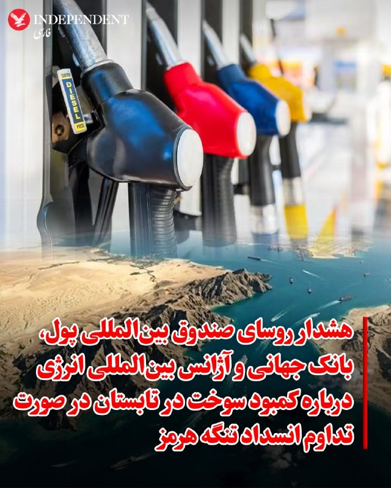

♦️رؤسای صندوق بین‌المللی پول (IMF)، بانک جهانی و آژانس بین‌المللی انرژی (IEA) روز جمعه هشتم خرداد، هشدار دادند که در صورت باز نگشتن تردد نفتکش‌ها در تنگه هرمز به روال عادی، امنیت سوخت در ماه‌های پرتقاضای تابستان با خطرات جدی مواجه خواهد شد.

روسای این نهادهای بین‌المللی در یک بیانیه مشترک اعلام کردند: «ذخایر جهانی نفت در واکنش به کاهش شدید عرضه ناشی از بحران تنگه هرمز، با سرعتی بی‌سابقه در حال کاهش است. اگر جریان کشتیرانی به حالت عادی بازنگردد، تخلیه سریع و مداوم ذخایر جهانی نفت در آستانه اوج تقاضای تابستانی در نیم‌کره شمالی، مخاطرات فزاینده‌ای را برای امنیت سوخت، شرایط بازار و انعطاف‌پذیری کلان اقتصادی به همراه خواهد داشت.»
‌🇸🇦 Indypersian

🤖 @VahidOOnLine

## VahidOOnLine — post 242826

  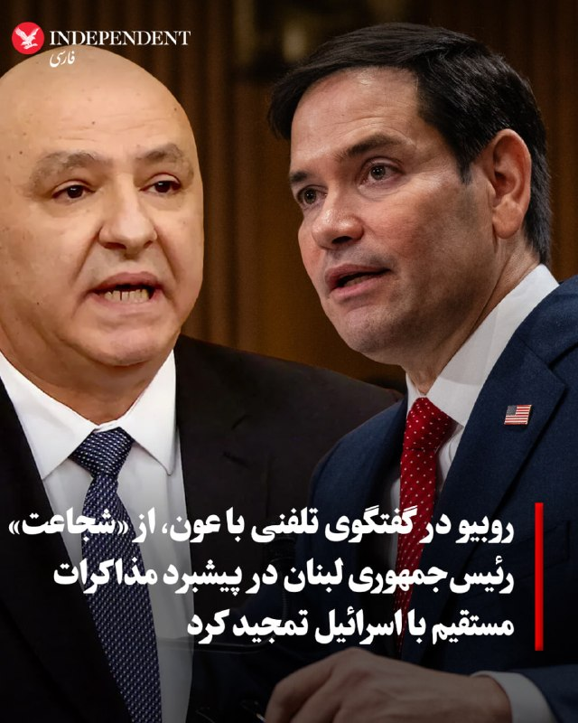

♦️وزارت امور خارجه آمریکا، روز جمعه، هشتم خردادماه، با انتشار بیانیه‌ای رسمی، جزئیات گفتگوی تلفنی مارکو روبیو، وزیر امور خارجه این کشور، با جوزف عون، رئیس‌جمهوری لبنان را اعلام کرد. در این بیانیه که از سوی تامی پیگات، سخنگوی وزارت خارجه صادر شده، آمده است که مارکو روبیو از «شجاعت و چشم‌انداز» ژوزف عون در پیشبرد مذاکرات مستقیم با اسرائیل تمجید کرده است. روبیو تاکید کرد که این تلاش‌ها در حالی صورت می‌گیرد که حزب‌الله همچنان به تلاش‌های خود برای به بن‌بست کشاندن این گفتگوها به قیمت منافع مردم لبنان ادامه می‌دهد.
وزیر امور خارجه آمریکا در این تماس بار دیگر حزب‌الله را مسئول کامل درگیری‌های جاری دانست و بر لزوم توقف فوری حملات و اقدامات تحریک‌آمیز این گروه برای فراهم شدن زمینه تنش‌زدایی تأکید کرد. او همچنین خاطرنشان کرد که ایالات متحده به طور کامل از دولت لبنان در مسیر دستیابی به یک فرصت تاریخی برای برقراری صلح، بازسازی کشور و ساختن آینده‌ای بهتر برای مردمش حمایت می‌کند.
‌🇸🇦 Indypersian

🤖 @VahidOOnLine

## VahidOOnLine — post 242825

  

اسکات بسنت، وزیر خزانه‌داری آمریکا، ضمن اعلام توقیف یک میلیارد دلار رمزارز مرتبط با جمهوری اسلامی، گفت: «ما در حال همکاری با متحدانمان در سراسر اروپا هستیم تا ویلاها، خانه‌ها و املاک مقامات جمهوری اسلامی را توقیف کنیم.»
او افزود: «این پولی است که از مردم ایران دزدیده شده است.»
‌🏁 🇬🇧 IranintlTV

🤖 @VahidOOnLine

## VahidOOnLine — post 242824

  <a href="telegram/content/VahidOOnLine_242824_1780090239.mp4" target="_blank">🎬 Download video</a>

یک شهروند در پیامی به ایران اینترنشنال می‌گوید سرعت اینترنت جهانی در ایران بسیار پایین است. پیام او با هوش مصنوعی خوانده شده است.
‌🏁 🇬🇧 IranintlTV

🤖 @VahidOOnLine

## VahidOOnLine — post 242823

ویدیوی منتشرشده، لحظه کشته شدن جاویدنام بابک سلطانی را در اصفهان نشان می‌دهد.
سلطانی، ۵۹ ساله، شامگاه ۱۹ دی ۱۴۰۴ هنگامی که معترضان را در اصفهان پناه می‌داد هدف شلیک گلوله ماموران قرار گرفت و جان باخت.
‌🏁 🇬🇧 IranintlTV

🤖 @VahidOOnLine

## VahidOOnLine — post 242822

  

اتحادیه اروپا با انتشار بیانیه‌ای اعلام کرد که حمله اخیر حکومت ایران علیه کویت را به شدت محکوم می‌کند.

در این بیانیه آمده که این حمله بنا بر حقوق بین‌الملل نقض حاکمیت کویت محسوب می‌شود.

اتحادیه اروپا همبستگی کامل خود را با دولت و مردم کویت بار دیگر اعلام کرد و افزود: «چنین حملاتی تهدیدی جدی برای امنیت و ثبات منطقه به شمار می‌روند.»
‌🏁 🇬🇧 IranintlTV

🤖 @VahidOOnLine

## VahidOOnLine — post 242821

  

♦️ اسکات بسنت، وزیر خزانه‌داری ایالات متحده، روز جمعه هشتم خرداد، اعلام کرد که این کشور در راستای بخش اقتصادی جنگ دونالد ترامپ، رئیس‌جمهوری آمریکا، علیه جمهوری اسلامی، که به عنوان «خشم اقتصادی» شناخته می‌شود، یک میلیارد دلار از دارایی‌های رمزارزی ایران را توقیف کرده است.
‌🇸🇦 Indypersian

🤖 @VahidOOnLine

## VahidOOnLine — post 242820

🗣روایت شما از بحران اقتصادی و زندگی در آتش‌بس- جمعه ۸ خرداد:

🔹جوانی ما سوخت پای سفاهت عده‌ای که هیچ درک و فهمی از شادی و سرور ندارند، نزدیک به ۵۰ سال سرمایه‌های کشور رو به یغما دادند، ولی آدمی به امید زنده است.

🔹از اصفهان: گرونی بیداد می‌کنه. از صبح تا شب کار می‌کنیم برای یک میلیون که اونم هیچی نمی‌شه باهاش بخری.

🔹اینا توافق بکنن یا نکنن، هیچ فرقی به حال ما مردم نداره. جمهوری اسلامی به زودی به دست مردم نابود خواهد شد، چون مردم تو شرایط وحشتناکی دارن زندگی می‌کنن.

🔹من یه نوجوون ۱۵ ساله‌ام. چرا باید به فکر قیمت طلا و دلار باشم؟ تنها آرزوی زندگیم فقط خرید موتوریه که آخرین بار قیمتش ۸۰ میلیون تومان بود و الان قیمت گرفتم شده ۲۰۰ تومان. این یعنی خاک کردن آرزوهامون. این حق ما نیست.

🔹من یه بچه ۱۲ ساله هستم، دارم حسرت می‌خورم چرا یه دوچرخه ندارم، هر روز آرزو می‌کنم شاهزاده برگرده، هم مردم خوشحال بشن و هم کسانی که آرزوی چیزی داشتن بتونن بخرنش.

🔹ما نوجوان‌ها واقعا بدبخت شدیم نه امیدی نه آرزویی نه آینده‌ای. از بدو تولد با کرونا، آلودگی، قطعی برق و آب، جنگ و کشتار سر کردیم.

🔹به عنوان یه جوان ۲۸ ساله خیلی وقته دیگه انگیزه و امیدی برای آینده ندارم؛ جوانی که از وقتی که یادشه فقط داره کار می‌کنه و حتی پاش رو از شهر خودش برای یه مسافرت دو روزه بیرون نذاشته. پرایدی که ۱۵ سال از عمر خودش گذشته رو نمی‌تونم بخرم. ما سوختیم.

🔹جمهوری اسلامی با این وحشی‌گری‌هاش به زودی به جایی می‌ره که اسکندر و چنگیز رفتند. به دست مردم شجاع ایران، نه ترامپ. زنده‌باد امید، زنده‌باد ایران، زنده‌باد آزادی.

🔹مردم عزیز ایران، این روزهای سخت هم می‌گذره. امیدتون رو از دست ندین؛ ما ملتی هستیم که بارها دوباره از نو بلند شده. کنار هم می‌مونیم، می‌جنگیم و ایران‌مون رو پس می‌گیریم. آینده از آنِ مردمه.
‌🏁 🇬🇧 IranintlTV

🤖 @VahidOOnLine

## WithYashar — post 12913

  

تصویری از داماد ۱۷ ساله و عروس ۱۶ ساله در تجمعات شبانه
@withyashar
زبانم قاسمه کتلته…🥴

## WithYashar — post 12912

صداوسیما: منابع محلی از فعال شدن سامانه پدافندی در جزیره قشم حوالی ساعت ۲۱:۲۵ خبر دادند.

بررسی‌های اولیه حاکی است این اقدام به احتمال زیاد در مقابله با ریزپرنده‌ها انجام شده و با موفقیت همراه بوده است.
سامانه‌های پدافندی آرش‌ کمان‌گیر در روزهای اخیر عملکرد موفقی در مقابله با پهپادهای دشمن داشته‌اند.
@withyashar

## WithYashar — post 12911

حسین علایی:
سه روز قبل از ۹ اسفند به شمخانی گفتم امریکا جنگ رو با تـرور رهبر شروع میکنه؛ گفت نمیتونن اینکارو کنن. چون نمیتونن پیداش کنن.
سه روز بعد هم خودشو زدن هم رهبر رو. اونا اطلاعاتشون خیلی قویه.
@withyashar

## WithYashar — post 12910

  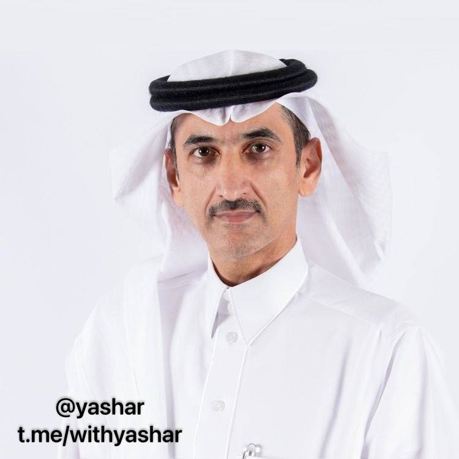

مالک شبکه ایران اینترنشنال به ادعای فاینانشال تایمز

گزارش Financial Times درباره ایران اینترنشنال می‌گوید این شبکه به‌صورت رسمی توسط شرکت بریتانیایی Volant Media UK اداره می‌شود، اما ساختار مالکیت آن پیچیده و چندلایه است و از طریق شرکت‌هایی در بریتانیا و جزایر کیمن انجام می‌شود. طبق این گزارش، این شرکت در سال‌های اخیر با زیان‌های سنگین و بدهی‌های بزرگ (بیش از ۴۰۰ میلیون پوند) روبه‌رو بوده و اخیراً بخشی از بدهی‌ها از طریق تبدیل بدهی به سهام بازسازی شده است. در جریان این تغییرات، سهام قابل توجهی به یک شرکت ثبت‌شده در جزایر کیمن به نام Info-Cast Cayman Limited منتقل شده که مدیر آن فردی به نام صالح حسین الدویس معرفی شده است؛ او در گزارش FT به‌عنوان مدیری مرتبط با گروه رسانه‌ای سعودی SRMG شناخته می‌شود. این گزارش تأکید می‌کند که مالکیت شبکه شفاف و مستقیم نیست و در قالب ساختارهای مالی پیچیده و آفشور انجام شده است
@withyashar

## WithYashar — post 12909

شاهزاده رضا پهلوی :اگر اروپا می‌تواند اتحادیه خودش را داشته باشد، چرا ما نتوانیم در خاورمیانه اتحادیه‌ای داشته باشیم؟
چرا نتوانیم در پروژه‌های مشترک مربوط به امنیت ملی، اطلاعات و حتی همکاری‌های نظامی همکاری کنیم؟
چرا باید بخش زیادی از بودجه‌مان را صرف تسلیحات و مسابقه تسلیحاتی کنیم، به جای اینکه این منابع را صرف رفاه، صندوق‌های بازنشستگی، بهداشت و آموزش کنیم؟
@withyashar

## WithYashar — post 12908

نیویورک پست: وجوه مسدود شده مستقیما به ایران ارسال نخواهد شد، بلکه برای خرید مواد غذایی و تجهیزات پزشکی استفاده خواهد شد و پرداخت آنها منوط به تعهد تهران به باز کردن تنگه هرمز و پاکسازی مین‌ها خواهد بود
@withyashar

## WithYashar — post 12907

شاهزاده رضا پهلوی:تصور کنید که فردا مدل سیلیکون ولی در سیستان و بلوچستان اجرا شود. چرا که نه؟

هر چیزی که کشور نیاز داشته باشد از هوش مصنوعی گرفته تا فناوری و نوآوری می‌تواند در آنجا توسعه یابد.
@withyashar

## WithYashar — post 12906

نیویورک تایمز به نقل از یک مقام دولتی:
نشست ترامپ در اتاق عملیات به پایان رسید وحدود دو ساعت به طول انجامید.
@withyashar

## WithYashar — post 12905

نیویورک پست: زمان نهایی شدن تفاهم‌نامه بین آمریکا و ایران مشخص نیست
@withyashar

## WithYashar — post 12904

وزیر خزانه‌داری آمریکا، اسکات بسنت:
ما حدود ۱ میلیارد دلار از رمزارزهای ایران را توقیف کرده‌ایم فقط مستقیم کیف‌پول‌ها را گرفته‌ایم.
برخی از آن‌ها شاید همین الان در حال تایپ کردن باشند و هنوز متوجه نشده‌اند که کیف‌پولشان گرفته شده است.
این پولی است که از مردم ایران دزدیده شده است.
@withyashar

## mwarmonitor — post 9903

  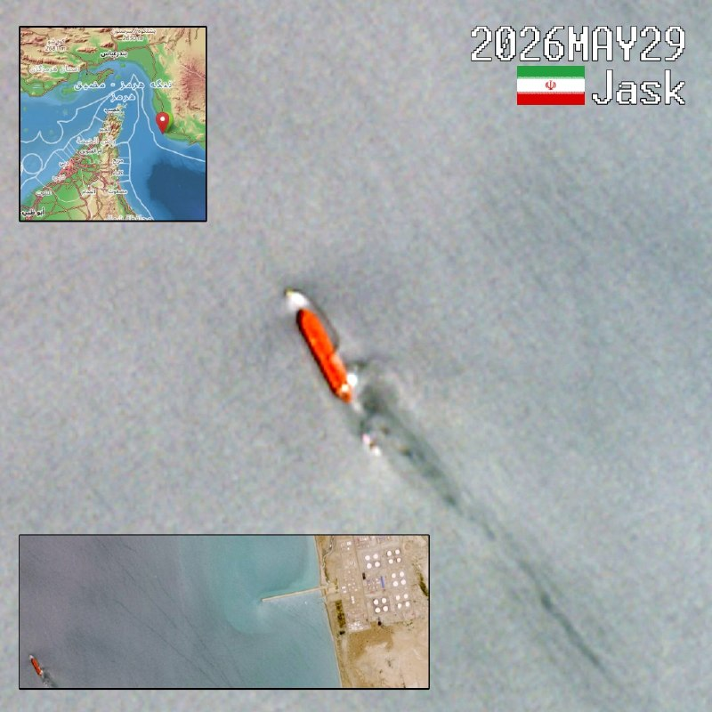

🔴 تانکر تارکرز: در روزهای اخیر، نفتکش‌ها در امتداد ساحل ایران و در تأسیسات دریایی اقدام به بارگیری نفت خام و انواع فرآورده‌های پالایش‌شده کرده‌اند. امروز (۲۹ مه ۲۰۲۶) نیز شاهد بارگیری یک نفتکش بسیار بزرگ (VLCC) به میزان دو میلیون بشکه نفت خام هستیم. @mwarmonitor

## mwarmonitor — post 9902

  

📌ملوانان نیروی دریایی آمریکا عملیات پرواز شبانه را روی ناو هواپیمابر «USS George H. W. Bush (CVN-77)» انجام می‌دهند. در شب، خلبانان بسیار ماهر می‌توانند در تاریکی تقریباً کامل، روی یک عرشه کوچک که در حال بالا و پایین رفتن و تکان خوردن است فرود بیایند.

@mwarmonitor

## mwarmonitor — post 9901

🔴فرمانده فرماندهی جنوبی ارتش آمریکا، ژنرال دونوفان، امروز در حاشیه خلیج گوانتانامو با فرماندهان ارشد نظامی کوبا دیدار کرده است. رویترز

@mwarmonitor

## mwarmonitor — post 9900

🔴یکی از آخرین گره‌های باقی‌مانده در مسیر توافق با ایران، آزادسازی مرحله‌ای منابع مالی است که در قطر نگهداری می‌شود و قرار است برای اهداف بشردوستانه مورد استفاده قرار گیرد — نیویورک تایمز.

@mwarmonitor

## mwarmonitor — post 9899

🔸یک منبع رسمی ایرانی همین حالا به من گفت:
«هیچ چیزی را نمی‌توان با تیمی که چارچوب حرفه‌ای یا اخلاقی ثابتی ندارد، دمدمی‌مزاج است و مدام خواسته‌هایش را تغییر می‌دهد، نهایی‌شده تلقی کرد.» علی هاشم خبرنگار الجزیره

@mwarmonitor

## mwarmonitor — post 9898

  

✈️در حال حاضر تنها پروازی که بر فراز اسرائیل در حال ارسال سیگنال است، یک هواپیمای سوخت‌رسان KC-135R Stratotanker متعلق به نیروی هوایی ایالات متحده است؛ در همین حال، یک فروند E-11A (گره ارتباطی هوابرد میدان نبرد – BACN) از پایگاه هوایی شاهزاده سلطان بر فراز عراق در حال گشت‌زنی (لوئیتر کردن) است.

@mwarmonitor

## mwarmonitor — post 9897

🔴دونالد ترامپ، رئیس‌جمهور آمریکا، یک نشست حدوداً دو ساعته در «اتاق وضعیت» را بدون اتخاذ تصمیم درباره توافق جدید با ایران ترک کرد. یک مقام ارشد دولت آمریکا این موضوع را به نیویورک‌تایمز گفته است.

🔴به گفته این مقام، دولت آمریکا معتقد است که رسیدن به توافق نزدیک است، اما همچنان اختلافاتی وجود دارد؛ از جمله بر سر آزادسازی دارایی‌های مسدودشده ایران.

@mwarmonitor

## FoxNewsTwitter — post 342412

Fox News (Twitter/X)

What are illegal migrants actually eating inside Delaney Hall?

According to a menu released by DHS, detainees are being served a wide range of meals including fajitas, burritos, jambalaya, chicken fried steak, fruit, vegetables, salads, brownies, and cake.

The release comes as New Jersey Democrats and far-left protesters criticize conditions at the ICE detention facility and stage demonstrations that have turned chaotic throughout the week.

NJ Governor Mikie Sherrill now says she is working to establish a "peaceful, protected, protest zone" with hopes to "lower the temperature."

## FoxNewsTwitter — post 342411

Fox News (Twitter/X)

“I’ll kill your whole f–king family. Your whole f–king family is dead. Your children, your wife, all dead."

That's just one of the chilling threats made to ICE agents outside a New Jersey facility, as the DOJ says it's now working to identify and arrest the demonstrators.

@AlexisMcAdamsTV shows just some of the moments investigators are looking into as chaotic protests continue at the Newark facility. | @AmericaRpts

## FoxNewsTwitter — post 342410

  

Fox News (Twitter/X)

Rep. Ilhan Omar is officially seeking another term in Congress.

The Minnesota Democrat has filed paperwork to run again, as a separate debate over who can serve in federal office is picking up steam on Capitol Hill.

Rep. Nancy Mace is currently pushing a constitutional amendment that would require members of Congress, federal judges, and Senate-confirmed appointees to be natural-born U.S. citizens.

The proposal faces a steep path forward, but it's already drawing attention as Omar prepares for another campaign.

Mace directly accused Omar of "foreign allegiance" when discussing her proposal.

## pm_afshaa — post 91877

  <a href="telegram/content/pm_afshaa_91877_1780090245.mp4" target="_blank">🎬 Download video</a>

ویدیویی از دقایق اول حمله اسراییل به بیت رهبری

💧 Rainbet.com the #1 Non-KYC Crypto Casino & Sportsbook @rainbetcom

😁 @Pm_Afshaa

## pm_afshaa — post 91876

  <a href="telegram/content/pm_afshaa_91876_1780090247.mp4" target="_blank">🎬 Download video</a>

شاهزاده رضا پهلوی:اگر اروپا می‌تواند اتحادیه خودش را داشته باشد، چرا ما نتوانیم در خاورمیانه اتحادیه‌ای داشته باشیم؟

چرا نتوانیم در پروژه‌های مشترک مربوط به امنیت ملی، اطلاعات و حتی همکاری‌های نظامی همکاری کنیم؟

چرا باید بخش زیادی از بودجه‌مان را صرف تسلیحات و مسابقه تسلیحاتی کنیم، به جای اینکه این منابع را صرف رفاه، صندوق‌های بازنشستگی، بهداشت و آموزش کنیم؟

💧 Rainbet.com the #1 Non-KYC Crypto Casino & Sportsbook @rainbetcom

😁 @Pm_Afshaa

## pm_afshaa — post 91875

  <a href="telegram/content/pm_afshaa_91875_1780090249.mp4" target="_blank">🎬 Download video</a>

شاهزاده رضا پهلوی:تصور کنید که فردا مدل سیلیکون ولی در سیستان و بلوچستان اجرا شود. چرا که نه؟

هر چیزی که کشور نیاز داشته باشد از هوش مصنوعی گرفته تا فناوری و نوآوری می‌تواند در آنجا توسعه یابد.

💧 Rainbet.com the #1 Non-KYC Crypto Casino & Sportsbook @rainbetcom

😁 @Pm_Afshaa

## pm_afshaa — post 91874

  <a href="telegram/content/pm_afshaa_91874_1780090251.mp4" target="_blank">🎬 Download video</a>

شاهزاده رضا پهلوی:چرا می‌گوییم جهان باید از مردم ایران در پیگیری آزادی حمایت کند؟

آنها به خاطر چشم‌های زیبای من یا شما این کار را نمی‌کنند.

آنها این کار را انجام می‌دهند چون به نفع منافع خودشان است.

ما باید آنها را قانع کنیم که حمایت از مردم ایران به نفعشان است.

💧 Rainbet.com the #1 Non-KYC Crypto Casino & Sportsbook @rainbetcom

😁 @Pm_Afshaa

## pm_afshaa — post 91873

🔴الجزیره:وزیر خزانه‌داری آمریکا مدعی شد که تحریم‌های ایران به تدریج لغو خواهد شد

💧 Rainbet.com the #1 Non-KYC Crypto Casino & Sportsbook @rainbetcom

😁 @Pm_Afshaa

## pm_afshaa — post 91872

رئیس شورای هماهنگی اسلامی :قرار است یک مراسم تشییع ده‌ها میلیون نفری برای رهبر شهید مفعولمون برگزار کنیم

💧 Rainbet.com the #1 Non-KYC Crypto Casino & Sportsbook @rainbetcom

😁 @Pm_Afshaa

## pm_afshaa — post 91870

https://t.me/proxy?server=87.248.129.12&port=15&secret=ee1603010200010001fc030386e24c3add626973636f7474692e79656b74616e65742e636f6d

پروکسی مخصوص دانلود

💧 Rainbet.com the #1 Non-KYC Crypto Casino & Sportsbook @rainbetcom

😁 @Pm_Afshaa

## DEJradio — post 5112

👑
🚨 شاهزاده رضا پهلوی: «از تمام ظرفیت تاثیرگذاری خود در راه انقلاب شیر و خورشید استفاده کنید.»

بخشی دیگر از نشست آنلاین با شماری از فعالان و چهره‌های رسانه‌ای و هنری، ۱ خرداد ۲۵۸۵/۱۴۰۵

#شاهزاده_رضا_پهلوی
#ایران_را_پس_میگیریم
@DEJradio

## VahidOnline — post 75796

  <a href="telegram/content/VahidOnline_75796_1780090253.mp4" target="_blank">🎬 Download video</a>

اسکات بسنت، وزیر خزانه‌داری ایالات متحده، روز جمعه هشتم خرداد در «مجمع اقتصادی ملی ریگان» اعلام کرد که واشنگتن حدود یک میلیارد دلار از دارایی‌های رمزارزی مرتبط با حکومت ایران را به طور مستقیم توقیف و کیف‌پول‌های دیجیتال آن‌ها را ضبط کرده است.

او با تاکید بر اینکه این اموال در واقع پول‌های دزدیده‌شده از مردم ایران است، اشاره کرد که بسیاری از صاحبان این حساب‌ها هنوز متوجه ضبط دارایی و کیف‌پول دیجیتال خود نشده‌اند.

وزیر خزانه‌داری آمریکا همچنین افزود واشنگتن با همکاری نزدیک متحدان اروپایی خود در حال ردیابی و توقیف املاک و مستغلات، از جمله ویلاها و خانه‌های متعلق به این افراد در سراسر اروپا است.
@VahidOOnLine

📡 @VahidOnline

## IranIntlTV — post 339659

  <a href="telegram/content/IranIntlTV_339659_1780090254.mp4" target="_blank">🎬 Download video</a>

در حالی که دولت آمریکا از پایان محاصره دریایی ایران و پیشرفت در تفاهم‌نامه با تهران خبر داده، در کنگره آمریکا پرسش‌هایی درباره هزینه‌های جنگ با ایران مطرح شده است. منتقدان، دولت ترامپ را به ارائه آمار ناقص و متناقض متهم می‌کنند.

گزارش نیلوفر منصوری، خبرنگار ایران‌اینترنشنال
@iranintltv

## IranIntlTV — post 339658

  <a href="telegram/content/IranIntlTV_339658_1780090255.mp4" target="_blank">🎬 Download video</a>

یک موشک نیو گلن متعلق به شرکت بلو اوریجین در جریان آزمایش روی سکوی پرتاب در کیپ کاناورال فلوریدا منفجر شد و ستون بزرگی از آتش و دود به هوا برخاست. این موشک بدون سرنشین برای چهارمین پرتاب آزمایشی و حمل ماهواره‌های پروژه آمازون لئو به مدار پایین زمین آماده می‌شد.…

## IranIntlTV — post 339657

  <a href="telegram/content/IranIntlTV_339657_1780090258.mp4" target="_blank">🎬 Download video</a>

وال‌استریت ژورنال در گزارشی اختصاصی از جزییات حملات امارات به ایران در جریان جنگ اخیر خبر داد. براساس این گزارش، این حملات با هماهنگی آمریکا و اسرائیل انجام شده و قشم، ابوموسی، بندرعباس، لاوان و عسلویه را هدف قرار داده است.

گفت‌وگو با غسان عاشور، تحلیل‌گر مسائل خاورمیانه
@iranintltv

## IranIntlTV — post 339656

  <a href="telegram/content/IranIntlTV_339656_1780090259.mp4" target="_blank">🎬 Download video</a>

وال‌استریت ژورنال در گزارشی اختصاصی از جزییات حملات امارات به ایران در جریان جنگ اخیر خبر داد. براساس این گزارش، این حملات با هماهنگی آمریکا و اسرائیل انجام شده و قشم، ابوموسی، بندرعباس، لاوان و عسلویه را هدف قرار داده است.

گفت‌وگو با غسان عاشور، تحلیل‌گر مسائل خاورمیانه
@iranintltv

## IranIntlTV — post 339655

  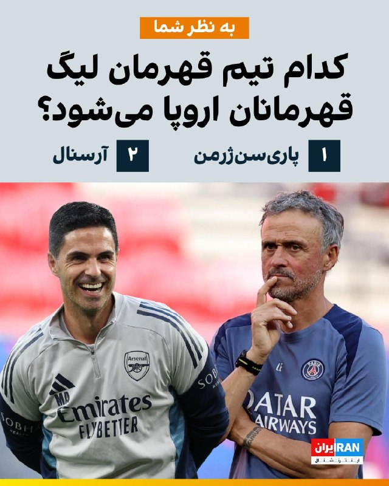

🔻تیم‌های فوتبال پاری‌سن‌ژرمن و آرسنال عصر شنبه در استادیوم پوشکاش آرنا شهر بوداپست مجارستان، در فینال لیگ قهرمانان اروپا، به مصاف یکدیگر می‌روند.

🔹به نظر شما کدام تیم کاپ قهرمانی را به خانه می‌برد؟ شاگردان لوییس انریکه یا میکل آرتتا؟

🔹برای شرکت در این نظرسنجی به صفحه اینستاگرام ایران اینترنشنال ورزشی مراجعه کنید؛👇
https://www.instagram.com/p/DY78FG6gjNx/

@iranintltvsport

## IranIntlTV — post 339654

  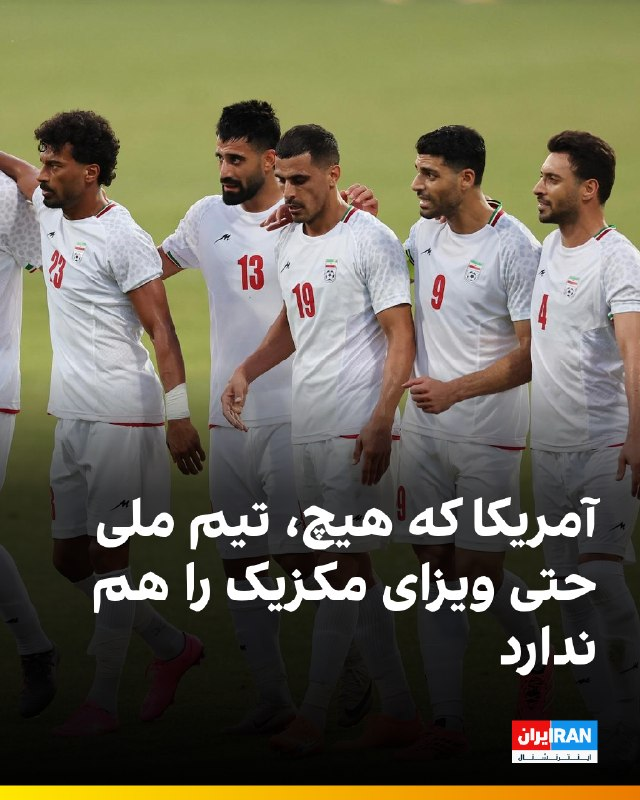

🔻تیم ملی فوتبال در حالی در اردوی آماده‌سازی برای حضور در جام جهانی ۲۰۲۶ به سر می‌برد که مهدی محمدنبی، سرپرست تیم ملی، اعلام کرد هنوز ویزای مکزیک و آمریکا صادر نشده است.

🔹او گفت: «ایمیلی به فیفا زدیم تا بدانیم چه روزی ویزاها صادر می‌شود. ما هم به ویزای مولتی مکزیک نیاز داریم و هم به ویزای مولتی آمریکا.»

🔹او که جمعه‌شب پس از بازی تیم ملی با گامبیا با خبرنگاران گفت‌وگو می‌کرد، افزود در آخرین مذاکرات اعلام شده است که «پروسه اداری، به احتمال بسیار زیاد، در همین هفته انجام می‌شود.»

🔹این اظهارات در حالی مطرح می‌شود که تنها ۱۲ روز تا آغاز جام جهانی باقی مانده و تکلیف ویزا و محل اقامت بسیاری از تیم‌های حاضر در جام جهانی در کانادا، آمریکا و مکزیک مشخص شده و به‌زودی اردوهای نهایی در کمپ‌های از پیش اعلام‌شده برپا می‌شود.

🔹با این حال، تیم ملی فوتبال ایران در آخرین لحظات از کمپ آریزونای آمریکا به کمپ تیخوانای مکزیک منتقل شد.

🔹رئیس‌جمهور مکزیک گفته است آمریکا علاقه‌ای نداشت تیم ایران در آن کشور اقامت داشته باشد و به همین دلیل مکزیک پذیرفته است تیم ملی کمپ خود را در این کشور برپا کند.

@iranintltvsport

## IranIntlTV — post 339653

  

وزارت خزانه‌داری آمریکا جمعه تحریم‌های جدیدی در چارچوب مقابله با تروریسم علیه شماری از افراد و نهادهای ایرانی و همچنین برخی اشخاص و شرکت‌های دیگر اعمال کرد.

بر اساس اعلام وزارت خزانه‌داری آمریکا هشت فرد و پنج نهاد را به فهرست تحریم‌های خود افزود. این تحریم‌ها عمدتا شبکه‌ای مرتبط با علی مجد سپهر و برخی شرکت‌های وابسته به وزارت دفاع و پشتیبانی نیروهای مسلح جمهوری اسلامی را هدف قرار داده است.

وزارت خزانه‌داری آمریکا افزود علی مجد سپهر، محمدعلی منصور دره‌شیری، سعید زاهدی، پیام اختریان، هدی باقری، فرزانه رضایی، رودابه سرمدی و منوچهر زندیان هشت فرد تحریم شده هستند.
https://iranintl.com/202605291930

## IranIntlTV — post 339652

  <a href="telegram/content/IranIntlTV_339652_1780090263.mp4" target="_blank">🎬 Download video</a>

نیویورک‌تایمز به نقل از یک مقام ارشد آمریکایی گزارش داد نشست دونالد ترامپ در اتاق وضعیت کاخ سفید پس از دو ساعت به پایان رسیده، اما او هنوز درباره هیچ توافق جدیدی با تهران به تصمیم نهایی نرسیده است.

گفت‌وگو با شایان سمیعی، کارشناس امنیت ملی، و لیلا مروتی، تحلیل‌گر سیاس
@iranintltv

## IranIntlTV — post 339651

  <a href="telegram/content/IranIntlTV_339651_1780090265.mp4" target="_blank">🎬 Download video</a>

در سردابی تاریک در تفلیس، گنجینه‌ ۴۰ هزار بطری شراب متعلق به استالین برای نخستین‌بار گشوده شده؛ مجموعه‌ای که گرجستان می‌خواهد آن را به سرمایه‌ای برای آینده تبدیل کند.

آرین ریسباف گزارش می‌دهد.
@iranintltv

## IranIntlTV — post 339650

  

یک مقام ایرانی به الجزیره گفت هیچ‌چیز را نمی‌توان با تیمی که چارچوب حرفه‌ای یا اخلاقی مشخصی ندارد، رفتاری غیرقابل پیش‌بینی از خود نشان می‌دهد و مدام خواسته‌هایش را تغییر می‌دهد، «نهایی‌شده» توصیف کرد.

پیش‌تر سخنگوی وزارت خارجه جمهوری اسلامی اعلام کرده بود مشکل اصلی در رسیدن به توافق، تغییر مواضع طرف آمریکایی است.
https://iranintl.com/202605294023

## IranIntlTV — post 339649

  

اسکات بسنت، وزیر خزانه‌داری آمریکا، ضمن اعلام توقیف یک میلیارد دلار رمزارز مرتبط با جمهوری اسلامی، گفت: «ما در حال همکاری با متحدانمان در سراسر اروپا هستیم تا ویلاها، خانه‌ها و املاک مقامات جمهوری اسلامی را توقیف کنیم.»
او افزود: «این پولی است که از مردم ایران دزدیده شده است.»
https://iranintl.com/202605295555

## IranIntlTV — post 339648

  <a href="https://t.me/IranintlTV/339648" target="_blank">📎 Download file</a>

🎧نسخه صوتی ۲۴ با فرداد فرحزاد: ترامپ: تهران پولی نخواهد گرفت و سلاح هسته‌ای نخواهد داشت
@iranintlTV

## IranIntlTV — post 339647

  <a href="telegram/content/IranIntlTV_339647_1780090268.mp4" target="_blank">🎬 Download video</a>

یک شهروند در پیامی به ایران اینترنشنال می‌گوید سرعت اینترنت جهانی در ایران بسیار پایین است. پیام او با هوش مصنوعی خوانده شده است.

## IranIntlTV — post 339646

  <a href="telegram/content/IranIntlTV_339646_1780090270.mp4" target="_blank">🎬 Download video</a>

اسرائیل‌هیوم در گزارشی از وجود یک شاخه محرمانه در موساد خبر داد که ماموریت آن عملیات نفوذ، جنگ روانی و بی‌ثبات‌سازی جمهوری اسلامی با هدف تغییر رژیم در ایران است.

گفت‌وگو با منشه امیر، کارشناس امور خاورمیانه
@iranintltv

## IranIntlTV — post 339645

  <a href="telegram/content/IranIntlTV_339645_1780090272.mp4" target="_blank">🎬 Download video</a>

رومانی سفیر روسیه را پس از برخورد یک پهپاد روسی به ساختمانی در خاک این کشور احضار کرد. مقام‌های اروپایی این حادثه را نقض حریم هوایی اتحادیه اروپا دانستند. کایا کالاس، مسئول سیاست خارجه اتحادیه اروپا، هم گفته مسکو نباید حریم این منطقه را نقض کند.
این برخورد هم‌زمان با حملات شبانه روسیه به اوکراین رخ داد و دست‌کم دو نفر زخمی شدند.
@iranintltv

## IranIntlTV — post 339644

ویدیوی منتشرشده، لحظه کشته شدن جاویدنام بابک سلطانی را در اصفهان نشان می‌دهد.
سلطانی، ۵۹ ساله، شامگاه ۱۹ دی ۱۴۰۴ هنگامی که معترضان را در اصفهان پناه می‌داد هدف شلیک گلوله ماموران قرار گرفت و جان باخت.

## IranIntlTV — post 339643

  

اتحادیه اروپا با انتشار بیانیه‌ای اعلام کرد که حمله اخیر حکومت ایران علیه کویت را به شدت محکوم می‌کند.

در این بیانیه آمده که این حمله بنا بر حقوق بین‌الملل نقض حاکمیت کویت محسوب می‌شود.

اتحادیه اروپا همبستگی کامل خود را با دولت و مردم کویت بار دیگر اعلام کرد و افزود: «چنین حملاتی تهدیدی جدی برای امنیت و ثبات منطقه به شمار می‌روند.»
https://iranintl.com/202605296946

## IranIntlTV — post 339642

  <a href="telegram/content/IranIntlTV_339642_1780090274.mp4" target="_blank">🎬 Download video</a>

با وجود گزارش‌هایی درباره توافق میان واشینگتن و تهران، سرنوشت مذاکرات همچنان در هاله‌ای از ابهام قرار دارد.

دونالد ترامپ برای تصمیم‌گیری نهایی درباره توافق احتمالی با جمهوری اسلامی در نشست اتاق وضعیت کاخ سفید شرکت می‌کند.

گفت‌وگو با شهیر شهیدثالث، تحلیل‌گر روابط بین‌الملل
@iranintltv

## IranIntlTV — post 339641

🗣روایت شما از بحران اقتصادی و زندگی در آتش‌بس- جمعه ۸ خرداد:

🔹جوانی ما سوخت پای سفاهت عده‌ای که هیچ درک و فهمی از شادی و سرور ندارند، نزدیک به ۵۰ سال سرمایه‌های کشور رو به یغما دادند، ولی آدمی به امید زنده است.

🔹از اصفهان: گرونی بیداد می‌کنه. از صبح تا شب کار می‌کنیم برای یک میلیون که اونم هیچی نمی‌شه باهاش بخری.

🔹اینا توافق بکنن یا نکنن، هیچ فرقی به حال ما مردم نداره. جمهوری اسلامی به زودی به دست مردم نابود خواهد شد، چون مردم تو شرایط وحشتناکی دارن زندگی می‌کنن.

🔹من یه نوجوون ۱۵ ساله‌ام. چرا باید به فکر قیمت طلا و دلار باشم؟ تنها آرزوی زندگیم فقط خرید موتوریه که آخرین بار قیمتش ۸۰ میلیون تومان بود و الان قیمت گرفتم شده ۲۰۰ تومان. این یعنی خاک کردن آرزوهامون. این حق ما نیست.

🔹من یه بچه ۱۲ ساله هستم، دارم حسرت می‌خورم چرا یه دوچرخه ندارم، هر روز آرزو می‌کنم شاهزاده برگرده، هم مردم خوشحال بشن و هم کسانی که آرزوی چیزی داشتن بتونن بخرنش.

🔹ما نوجوان‌ها واقعا بدبخت شدیم نه امیدی نه آرزویی نه آینده‌ای. از بدو تولد با کرونا، آلودگی، قطعی برق و آب، جنگ و کشتار سر کردیم.

🔹به عنوان یه جوان ۲۸ ساله خیلی وقته دیگه انگیزه و امیدی برای آینده ندارم؛ جوانی که از وقتی که یادشه فقط داره کار می‌کنه و حتی پاش رو از شهر خودش برای یه مسافرت دو روزه بیرون نذاشته. پرایدی که ۱۵ سال از عمر خودش گذشته رو نمی‌تونم بخرم. ما سوختیم.

🔹جمهوری اسلامی با این وحشی‌گری‌هاش به زودی به جایی می‌ره که اسکندر و چنگیز رفتند. به دست مردم شجاع ایران، نه ترامپ. زنده‌باد امید، زنده‌باد ایران، زنده‌باد آزادی.

🔹مردم عزیز ایران، این روزهای سخت هم می‌گذره. امیدتون رو از دست ندین؛ ما ملتی هستیم که بارها دوباره از نو بلند شده. کنار هم می‌مونیم، می‌جنگیم و ایران‌مون رو پس می‌گیریم. آینده از آنِ مردمه.

## IranIntlTV — post 339640

  <a href="telegram/content/IranIntlTV_339640_1780090276.mp4" target="_blank">🎬 Download video</a>

اسرائیل‌هیوم گزارش داده موساد شاخه‌ای محرمانه برای عملیات نفوذ و جنگ روانی علیه جمهوری اسلامی با هدف تغییر رژیم ایجاد کرده است. این گزارش همچنین گفته رییس موساد معتقد است در صورت ادامه محاصره دریایی و شکست توافق با جمهوری اسلامی، حکومت ایران تا پایان ۲۰۲۶ سقوط می‌کند.
@iranintltv

## Shin_Persian — post 6312

Shin ✓ @hey_itsmyturn
Fri, 29 May 2026 21:03:59 UTC

Source tells me that an Iranian Lieutenant has been killed by shrapnel.
Qeshm island, Hormozgan Province, #Iran

فارسی

منابع به من می‌گویند که یک ستوان ایرانی بر اثر اصابت ترکش کشته شده است.
جزیره قشم، استان هرمزگان، #Iran_

𝕏 · @shin_persian

## Shin_Persian — post 6311

Shin ✓ @hey_itsmyturn
Fri, 29 May 2026 21:01:23 UTC

Ali Hashem is Barak Ravid, but the Al Jazeera version

فارسی

علی هاشم همان باراک راوید است، اما در نسخه الجزیره.

𝕏 · @shin_persian

## Shin_Persian — post 6310

↩️ Quoted tweet: Nevo @Nevo2702 Fri, 29 May 2026 20:31:54 UTC @hey_itsmyturn תרגם ↩️ Quoted tweet — see the post below for the reply. English @hey_itsmyturn Translate ↩️ توییت نقل‌قول شده — برای پاسخ، پست زیر را ببینید. فارسی درخواست ترجمه @hey_itsmyturn…

## Shin_Persian — post 6309

↩️ Quoted tweet:
Nevo @Nevo2702
Fri, 29 May 2026 20:31:54 UTC

@hey_itsmyturn תרגם

↩️ Quoted tweet — see the post below for the reply.

English

@hey_itsmyturn Translate

↩️ توییت نقل‌قول شده — برای پاسخ، پست زیر را ببینید.

فارسی

درخواست ترجمه @hey_itsmyturn

𝕏 · @shin_persian

## Shin_Persian — post 6308

Shin ✓ @hey_itsmyturn
Fri, 29 May 2026 20:31:19 UTC

Treasury's Economic Fury campaign targets Iran-based procurement network that impersonated U.S. businesses to fraudulently acquire restricted military goods for Iran's Ministry of Defense and Armed Forces Logistics (MODAFL). The scheme defrauded dozens of U.S. IT companies out of millions of dollars while procuring network security equipment and encryption technology.

𝐈𝐧𝐝𝐢𝐯𝐢𝐝𝐮𝐚𝐥𝐬:
- 𝐀𝐥𝐢 𝐌𝐚𝐣𝐝 𝐒𝐞𝐩𝐞𝐡𝐫 (Iran) - Mastermind who operated through Sorena company to impersonate U.S. small businesses and procure restricted goods including spectrum analyzers and non-linear junction detectors for MODAFL
- 𝐑𝐨𝐮𝐝𝐚𝐛𝐞𝐡 𝐒𝐚𝐫𝐦𝐚𝐝𝐢 (Iran) - Chairperson of board of directors for Sorena Hushmand Samaneh Company
- 𝐌𝐨𝐡𝐚𝐦𝐦𝐚𝐝𝐚𝐥𝐢 𝐌𝐚𝐧𝐬𝐨𝐮𝐫 𝐃𝐚𝐫𝐞𝐡𝐬𝐡𝐢𝐫𝐢 (Iran) - Dubai-based intermediary who paid U.S. freight forwarders and facilitated shipments through UAE front companies
- 𝐒𝐚𝐢𝐞𝐝 𝐙𝐚𝐡𝐞𝐝𝐢 (Italy, Iranian national) - Used U.S. financial account to pay for domain registration services that impersonated legitimate U.S. businesses
- 𝐌𝐚𝐧𝐨𝐨𝐜𝐡𝐞𝐡𝐫 𝐙𝐚𝐧𝐝𝐢𝐚𝐧 (Iran) - Sorena sales manager who assisted in transferring U.S.-origin products to Iran
- 𝐇𝐨𝐝𝐚 𝐁𝐚𝐫𝐚𝐝𝐚𝐫𝐚𝐧 𝐁𝐚𝐠𝐡𝐞𝐫𝐢 (Iran) - Sorena sales manager involved in procurement scheme
- 𝐅𝐚𝐫𝐳𝐚𝐧𝐞𝐡 𝐑𝐞𝐳𝐚𝐞𝐢 (Iran) - Sorena sales manager facilitating illegal transfers
- 𝐒𝐚𝐲𝐲𝐚𝐝 𝐏𝐚𝐲𝐚𝐦 𝐀𝐤𝐡𝐭𝐚𝐫𝐢𝐚𝐧 (Iran) - Sorena sales manager supporting procurement operations

𝐄𝐧𝐭𝐢𝐭𝐢𝐞𝐬:
- 𝐒𝐨𝐫𝐞𝐧𝐚 𝐇𝐮𝐬𝐡𝐦𝐚𝐧𝐝 𝐒𝐚𝐦𝐚𝐧𝐞𝐡 𝐂𝐨𝐦𝐩𝐚𝐧𝐲 (Iran) - Primary front company used to impersonate U.S. businesses for fraudulent procurement
- 𝐒𝐚𝐢𝐫𝐚𝐧 𝐈𝐧𝐟𝐨𝐫𝐦𝐚𝐭𝐢𝐨𝐧 𝐄𝐱𝐜𝐡𝐚𝐧𝐠𝐞 𝐒𝐩𝐚𝐜𝐞 𝐒𝐞𝐜𝐮𝐫𝐢𝐭𝐲 𝐈𝐧𝐝𝐮𝐬𝐭𝐫𝐢𝐞𝐬 𝐂𝐨𝐦𝐩𝐚𝐧𝐲 (𝐒𝐀𝐀𝐅𝐓𝐀) (Iran) - MODAFL-controlled entity that received procured goods
- 𝐆𝐫𝐞𝐞𝐧 𝐋𝐢𝐠𝐡𝐭 𝐂𝐨𝐦𝐩𝐮𝐭𝐞𝐫 𝐂𝐨 𝐋𝐋𝐂 (Dubai, UAE) - Front company controlled by Darehshiri for receiving and re-exporting shipments
- 𝐀𝐥 𝐊𝐚𝐰𝐭𝐡𝐞𝐫 𝐍𝐞𝐨𝐧 𝐋𝐋𝐂 (Dubai, UAE) - Additional Dubai-based front company used alongside Green Light for facilitation

𝐊𝐞𝐲 𝐎𝐩𝐞𝐫𝐚𝐭𝐢𝐨𝐧𝐬 𝐃𝐞𝐭𝐚𝐢𝐥𝐬:
- Network targeted network security and encryption software/hardware from U.S. small businesses
- Fraudulent procurement involved creating fake domain names mimicking legitimate U.S. companies
- Goods were shipped from U.S. to UAE, then re-exported to Iran
- Scheme specifically sourced spectrum analyzers and non-linear junction detectors for Iranian military

𝐄𝐜𝐨𝐧𝐨𝐦𝐢𝐜 𝐅𝐮𝐫𝐲 𝐂𝐚𝐦𝐩𝐚𝐢𝐠𝐧 𝐂𝐨𝐧𝐭𝐞𝐱𝐭:
Treasury reports disrupting tens of billions in Iranian regime revenue, including freezing nearly $500 million in regime-linked cryptocurrency. Campaign includes targeting shadow banking networks, oil trade facilitation, and digital asset exploitation. State Department offers $15 million reward for information disrupting IRGC financial mechanisms.

All designated persons' U.S.-based assets are blocked. Foreign financial institutions risk secondary sanctions for facilitating transactions with designated persons.

ترجمه فارسی در بخش نظرات

𝕏 · @shin_persian

## FarsiVOA — post 219029

  <a href="telegram/content/FarsiVOA_219029_1780090278.mp4" target="_blank">🎬 Download video</a>

⚡️بانک مرکزی اروپا می‌گوید برای مهار تورم آمادگی دارد
@FarsiVOA

## FarsiVOA — post 219028

🔺اسکات بسنت: در ایران از طرفی «دین‌سالاری» روحانیون را داریم و از طرف دیگر «اوباش‌سالاری» سپاه؛ املاک مقامات رژیم در اروپا توقیف می‌شود

▪️اسکات بسنت، وزیر خزانه‌داری آمریکا روز جمعه ۸ خرداد گفت ایالات متحده با همکاری شرکای اروپایی در حال پیدا کردن و توقیف «ویلاها، خانه‌ها و املاک» مقامات جمهوری اسلامی در اروپا است.

⬇️ بیشتر بخوانید:
https://ir.voanews.com/a/8155375.html
@FarsiVOA

## FarsiVOA — post 219027

  <a href="https://t.me/farsivoa/219027" target="_blank">📎 Download file</a>

🔴📢‌ پادکست خبری جمعه ۸ خرداد ۱۴۰۵

🛜در صورتی که با مشکل اینترنت مواجه هستید میتوانید اخبار صدای آمریکا را از نسخه‌های پادکست خبری ما به صورت صوتی دنبال کنید و یا اخبار را از نسخه سبک وب‌سایت ما پیگیر باشید:
https://ir.voanews.com/lite

📡بروزترین فرکانسهای ماهواره‌ای را نیز میتوانید از صفحه زیر پیگیری کنید:
https://ir.voanews.com/satellite

🔔دیگر شبکه‌های اجتماعی ما را هم دنبال کنید:
https://linktr.ee/voafarsi

با دوستانتان به اشتراک بگذارید
@farsivoa

## FarsiVOA — post 219026

  <a href="telegram/content/FarsiVOA_219026_1780090280.mp4" target="_blank">🎬 Download video</a>

⚡️کامبیز غفوری در برنامه تفسیر خبر: در درجه اول تمام تیغ ملامت به حکومتی است که این بلا را سر مردم ایران آورده است
@FarsiVOA

## FarsiVOA — post 219025

  <a href="telegram/content/FarsiVOA_219025_1780090281.mp4" target="_blank">🎬 Download video</a>

⚡️چرا ناتو در عملیات «خشم حماسی» در کنار آمریکا قرار نگرفت؟ گفت‌وگو با فرزانه روستایی
@FarsiVOA

## FarsiVOA — post 219024

  <a href="telegram/content/FarsiVOA_219024_1780090281.mp4" target="_blank">🎬 Download video</a>

⚡️تکرار پدیده زن‌کشی در ایران؛ دلایل آن، ریشه‌های فرهنگی و نواقص قانونی؛ گفت‌وگو با جلال ایجادی
@FarsiVOA

## FarsiVOA — post 219023

  <a href="telegram/content/FarsiVOA_219023_1780090282.mp4" target="_blank">🎬 Download video</a>

⚡️روند خلع سلاح گروه‌های شبه نظامی عراقی و ماهیت پشت پرده این اتفاق؛ گفت‌وگو با فرزین کرباسی
@FarsiVOA

## FarsiVOA — post 219022

⚡️بخشی از برنامه تفسیر خبر: گزارش نرگس صبا از سابقه فعالیت‌های موساد در ایران
@FarsiVOA

## FarsiVOA — post 219021

⚡️واشنگتن منتظر تصمیم پرزیدنت ترامپ؛ جمهوری اسلامی درگیر روایت‌های متناقض
@FarsiVOA

## FarsiVOA — post 219020

🔺گزارش وال‌استریت ژورنال: نقش پنهان امارات در جنگ شامل ده‌ها حمله به جمهوری اسلامی ایران بود

▪️روزنامه وال‌استریت ژورنال در گزارشی نوشت که امارات متحده عربی از آغاز روزهای نخست جنگ، ده‌ها حمله هوایی علیه جمهوری اسلامی انجام داده است.

⬇️ بیشتر بخوانید:
https://ir.voanews.com/a/8155371.html
@FarsiVOA

## FarsiVOA — post 219019

  <a href="telegram/content/FarsiVOA_219019_1780090283.mp4" target="_blank">🎬 Download video</a>

⚡️نیک آهنگ کوثر در برنامه تفسیر خبر: در اسرائیل کسانی تمایل ندارند تفاهم نامه احتمالی بین جمهوری اسلامی و آمریکا به یک توافق نامه برسد
@FarsiVOA

## FarsiVOA — post 219018

  <a href="telegram/content/FarsiVOA_219018_1780090284.mp4" target="_blank">🎬 Download video</a>

⚡️برخورد با دارندگان استارلینک با قوانین جمهوری اسلامی هم هم‌خوانی ندارد؛ گفت‌وگو با حسین احمدی‌نیاز؛ حقوق‌دان
@FarsiVOA

## FarsiVOA — post 219017

🔺تداوم بلاتکلیفی معترضان بازداشت‌شده در ایران؛ گزارش‌ها: یک دانش‌آموز ۴ ماه در بازداشت بوده است

▪️بر اساس گزارش‌های رسیده به کمیته پیگیری وضعیت بازداشت‌شدگان، سه شهروند به نام‌های دیانا طاهرآبادی، مائده رحیمی، و نیما حسینی همچنان در بازداشت به سر می‌برند و نگرانی‌ها درباره وضعیت حقوقی، روند رسیدگی قضایی و شرایط نگهداری آنان ادامه دارد.

⬇️ بیشتر بخوانید:
https://ir.voanews.com/a/detained-citizens-including-student/8155283.html
@FarsiVOA

## FarsiVOA — post 219016

  <a href="telegram/content/FarsiVOA_219016_1780090285.mp4" target="_blank">🎬 Download video</a>

⚡️اقتصاد ویران و بازگشت اینترنت نصف‌ونیمه؛ نظرات کاربران شبکه‌های اجتماعی
@FarsiVOA

## FarsiVOA — post 219015

  <a href="telegram/content/FarsiVOA_219015_1780090285.mp4" target="_blank">🎬 Download video</a>

⚡️منشه امیر در برنامه تفسیر خبر: از دیدگاه اسرائیل خطر موشکی جمهوری اسلامی مهمتر از خطر اتمی آن است
@FarsiVOA

## FarsiVOA — post 219014

🔺دیدگاه | توقیف و ادعای توقیف با مکث بر نمونه اخیر فیلم «تهران، کنارت»

▪️اواخر برگزاری جشنواره چهل و چهارم فیلم فجر بود. اوایل نیمه دوم بهمن ۱۴۰۴. دبیر جشنواره در تلویزیون حکومتی جمهوری اسلامی گفت: «جهان و سینما محل رفت و آمد است. باید پیش از آن که نوبت به ما برسد، با احترام به غصه‌های هم، مدارا و تحمل را در این خانه تمرین کنیم». مقصود منوچهر شاهسواری از این حرف که به ظاهر، هم فلسفی و مرگ‌آگاهانه جلوه می‌‌کرد و هم عاطفی، چه بود؟

⬇️ بیشتر بخوانید:
https://ir.voanews.com/a/opinion-iran-cinema-movie-kenarat-tehran-another-view/8154837.html
@FarsiVOA

## Persian_Trend_Official — post 15302

  <a href="telegram/content/Persian_Trend_Official_15302_1780090286.webm" target="_blank">🎬 Download video</a>

نهاد مدیریت آب‌راه خلیج فارس: تسلط بر تنگهٔ هرمز را با تحریم هم به دست نخواهید آورد.

نهاد مدیریت آب‌راه خلیج فارس: تسلط بر تنگهٔ هرمز را که در میدان و دیپلماسی به دست نیاوردید، با تحریم هم به دست نخواهید آورد.

📝 Amir

📌 @persian_trend_official
پرشین ترند | متفاوت‌ترین کانال نظامی

## Persian_Trend_Official — post 15300

  <a href="telegram/content/Persian_Trend_Official_15300_1780090287.mp4" target="_blank">🎬 Download video</a>

ارتش اسرائیل با انتشار مستنداتی می‌گوید که شب گذشته یکی از چند راکت شلیک شده از سوی حزب‌الله لبنان به سمت شهر مرجعیون به کلیسای این شهر اصابت کرده است.

ارتش اسرائیل همچنین گفت که سربازان ارتش اسرائیل در منطقه نزدیک کلیسا عملیاتی انجام نمی‌دهند.

📝 Amir

📌 @persian_trend_official
پرشین ترند | متفاوت‌ترین کانال نظامی

## Persian_Trend_Official — post 15299

  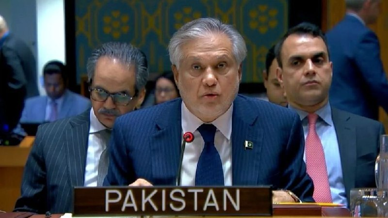

وزیر خارجه پاکستان: به پیمان ابراهیم ملحق‌ نمی شویم.

وزیر امور خارجه پاکستان در پاسخ به گفته چند شب پیش دونالد ترامپ رئیس جمهور امریکا گفت: هیچ انعطاف‌پذیری در موضع ما وجود ندارد و ما حامی تشکیل کشور مستقل فلسطینی هستیم.

📝 Amir

📌 @persian_trend_official
پرشین ترند | متفاوت‌ترین کانال نظامی

## Persian_Trend_Official — post 15298

  <a href="telegram/content/Persian_Trend_Official_15298_1780090289.mp4" target="_blank">🎬 Download video</a>

معجزات حضرت عاقا روز به روز بیشتر افشا میشه !
چندوقت دیگه خاطرات صیغه جور کردن برای اعضای بیت درمیاد !

حالا یک درصد احتمال ندادید دختر پسر رو نخواد ؟
نیم درصد ازمایش خون مشکل داشته باشه ؟
تفاهم و این حرفها هم که سوسول بازیه !
جایگاه زن در ولایت فقیه ...

## Persian_Trend_Official — post 15297

  <a href="telegram/content/Persian_Trend_Official_15297_1780090291.mp4" target="_blank">🎬 Download video</a>

وقتی طرف مقابل وضعیت نظامی خود را در همین شرایط حفظ کند، یعنی حفظ سایه جنگ بر کشور را پذیرفتیم. در حالی که دشمن باید از منطقه اخراج شود تا جمهوری اسلامی ایران چهارپایه طناب دار اقتصادی که در تنگه هرمز به گردن غرب انداخته را نکشد.

📌 @persian_trend_official
پرشین ترند | متفاوت‌ترین کانال نظامی

## Persian_Trend_Official — post 15296

  <a href="telegram/content/Persian_Trend_Official_15296_1780090293.webm" target="_blank">🎬 Download video</a>

Elyas Farokh – اتاق جنگ جمعه 8 خرداد | بوی جنگ از توافق ترامپ با جمهوی اسلامی!

## Persian_Trend_Official — post 15295

  <a href="https://t.me/persian_trend_official/15295" target="_blank">📎 Download file</a>

فایل صوتی لایو اول
نسخه کم حجم - 6 مگابایت

اتاق جنگ جمعه 8 خرداد | بوی جنگ از توافق ترامپ با جمهوی اسلامی!

📝 Nick

📌 @persian_trend_official
پرشین ترند | متفاوت‌ترین کانال نظامی

## Persian_Trend_Official — post 15294

  

نیویورک تایمز: ترامپ هیچ تصمیمی درباره ایران نگرفت!

نیویورک تایمز گزارش داد که دونالد ترامپ رئیس‌جمهور آمریکا پس از یک نشست دو ساعته در کاخ سفید درباره احتمال تمدید آتش‌بس با ایران، بدون اتخاذ تصمیم نهایی جلسه را ترک کرد.

📝 Amir

📌 @persian_trend_official
پرشین ترند | متفاوت‌ترین کانال نظامی

## RadioFarda — post 157705

  

🔸اسکات بسنت، وزیر خزانه‌داری آمریکا، روز جمعه اعلام کرد که ایالات متحده در چارچوب بخش اقتصادی جنگ دولت دونالد ترامپ علیه جمهوری اسلامی، «یک میلیارد دلار» از دارایی‌های رمزارزی مرتبط با ایران را توقیف کرده است.

🔸او اواخر فروردین خبر داده بود که آمریکا بیش از ۳۴۰ میلیون دلار رمزارز را به‌ظن ارتباط با ایران مسدود کرد.

🔸آقای بسنت پیش از این گفته است که بعد از برقراری آتش‌بس، به دستور دونالد ترامپ برنامه «خشم اقتصادی» را علیه حکومت ایران اجرا می‌کند و در این چارچوب تا به حال ده‌ها صرافی، کشتی، شرکت و فرد حقیقی به فهرست تحریم‌های وزارت خزانه‌داری افزوده شده‌اند.

🔸وزیر خزانه‌داری آمریکا همچنین روز جمعه گفت که هرگونه کاهش یا لغو محاصره مالی و اقتصادی آمریکا علیه ایران، به‌صورت تدریجی انجام خواهد شد.

🔸او اعلام کرد: «خواهیم دید... هر چیزی که برداشته شود، به‌آرامی و مرحله‌به‌مرحله برداشته خواهد شد.»

@RadioFarda

## RadioFarda — post 157704

آیا توافق موقت ایران و آمریکا در آستانهٔ رسیدن به مرحلهٔ پایانی است؟

🔸با وجود انتشار گزارش‌های ضدونقیض از تهران و واشینگتن دربارهٔ احتمال یک توافق موقت، کاخ سفید هنوز به‌طور شفاف اعلام نکرده است که آیا دو کشور به توافق نزدیک شده‌اند یا نه.

🔸اسکات بسنت، وزیر خزانه‌داری آمریکا، به خبرنگاران گفته است مذاکرات همچنان ادامه دارد و تأکید کرده که دونالد ترامپ، رئیس‌جمهور آمریکا، «توافق بدی» را برای ایالات متحده نخواهد پذیرفت.

🔸همزمان، گزارش‌هایی منتشر شده که نشان می‌دهد ایران و آمریکا پیرامون یک توافق موقت ۶۰ روزه برای تمدید آتش‌بس و احیای مذاکرات هسته‌ای به جمع‌بندی رسیده‌اند.

🔸انتشار این گزارش‌ها اختلاف دیدگاه‌ها در دولت ترامپ و میان جمهوری‌خواهان را برجسته کرده است. منتقدان می‌گویند کاخ سفید در شرایطی موضع نرم‌تری در قبال تهران در پیش گرفته که تنش‌ها در تنگه هرمز همچنان ادامه دارد.

🔸برای درک بهتر آن‌چه ممکن است پشت صحنه در جریان باشد، رادیو اروپای آزاد/رادیو آزادی با الکساندر گری، رئیس دفتر شورای امنیت ملی در دورهٔ نخست ریاست‌جمهوری دونالد ترامپ و مدیرعامل کنونی شرکت مشاوره ژئوپلیتیک «امریکن گلوبال استراتجیز»، گفت‌وگو کرده است.

🔸متن کامل این گفت‌وگو را در وب‌سایت رادیوفردا بخوانید.

@RadioFarda

## IranianMinds — post 21046

  

🔴 پیت هگزت وزیر جنگ آمریکا :

ایران بهتره زودتر انتخاب کنه یا مذاکره هسته ای یا جنگ با آمریکا , ایندفه نه بلکه از روی آسمان و دریا از روی زمین هم باید با ما روبرو بشن!

@IranianMinds

## IranianMinds — post 21045

  <a href="telegram/content/IranianMinds_21045_1780090296.mp4" target="_blank">🎬 Download video</a>

🔴 ویدئویی از دقایق اول حمله اسرائیل به بیت رهبری.

@IranianMinds

## IranianMinds — post 21044

  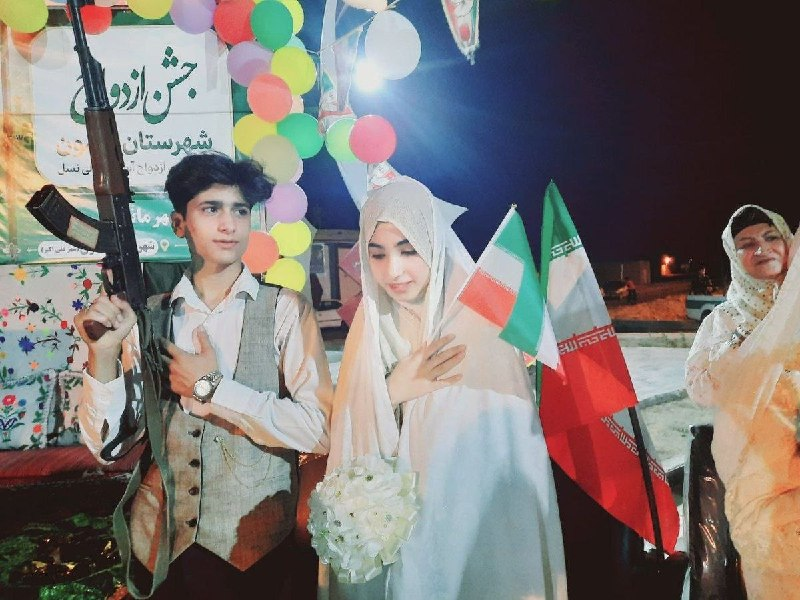

🔴 داماد 17 ساله عروس 16 ساله در تجمعات حکومتی !

اینا تا بزرگ شن یه 30 40 تا توله هم میندازن بعد میگید چرا اینا زیاد شدن ...

@IranianMinds

## IranianMinds — post 21043

  <a href="telegram/content/IranianMinds_21043_1780090298.mp4" target="_blank">🎬 Download video</a>

🔴 وزیر خزانه داری آمریکا :

ما حدود ۱ میلیارد دلار از ارزهای دیجیتال ایران را توقیف کرده‌ایم؛ یعنی خیلی ساده و مستقیم کیف پول‌هایشان را تصاحب کردیم.

برخی از آن‌ها ممکن است همین حالا در حال تایپ کردن و چک کردن حسابشان باشند و هنوز متوجه نشده باشند که کیف پولشان از دست رفته است.

این‌ها پول‌هایی است که از مردم ایران دزدیده شده است.

@IranianMinds

## IranianMinds — post 21042

  <a href="telegram/content/IranianMinds_21042_1780090300.mp4" target="_blank">🎬 Download video</a>

🔴 وزیر خزانه داری آمریکا :

ما حکومت را سرنگون نکردیم، اما ساختار آن را تغییر دادیم.

رهبران سطح اول حذف شدند، رهبران سطح دوم هم حذف شدند.

بنابراین، ما اکنون با مدیران و فرماندهان سطح سوم سر و کار داریم.

@IranianMinds

## BBCPersian — post 282353

🔻 نتیجه نشست ترامپ درباره تمدید آتش‌بس با ایران هنوز مشخص نیست

دونالد ترامپ جلسه‌ای با مشاوران خود برگزار کرده است تا درباره تمدید آتش‌بس با ایران تصمیم نهایی را اتخاذ کند، اما نتیجه این نشست هنوز مشخص نیست.

او پیش از این جلسه در اتاق بحران کاخ سفید تاکید کرده بود که توافق مورد مذاکره تضمین خواهد کرد که ایران تنگه هرمز را بازگشایی کند و متعهد شود هرگز به سلاح هسته‌ای دست پیدا نکند.

او همچنین گفت که ذخایر اورانیوم غنی‌شده ایران از زیر زمین خارج و نابود خواهد شد.

با این حال، مقام‌های ایرانی تاکید کرده‌اند که پیش‌نویس توافق شامل بازگشایی تنگه هرمز بدون دریافت عوارض و نیز تعهد به نابودی مواد هسته‌ای نیست.

تهران همچنین می‌گوید که هنوز درباره تمدید آتش‌بس برای ۶۰ روز دیگر، به‌منظور ادامه مذاکرات درباره جزئیات پیچیده‌تر توافق، تصمیم نهایی نگرفته است.

https://bbc.in/49xolqx
@BBCPersian

## BBCPersian — post 282352

🔻 خوش‌بینی به آتش‌بس با ایران، بازده اوراق قرضه دولت آمریکا را کاهش داد

بازده اوراق قرضه دولت آمریکا روز جمعه برای چهارمین روز متوالی کاهش یافت و هفته‌ای را به پایان رساند که گزارش‌های پیشرفت در دستیابی به آتش‌بس میان آمریکا و ایران، به خوش‌بینی نسبی در بازارها دامن زده بود.

میشل بومن، نایب‌رئیس نظارت بانک مرکزی آمریکا، در سخنانی گفت که هنوز برای ارزیابی تاثیر جنگ خاورمیانه بر اقتصاد زود است، اما یک شوک طولانی‌مدت در بازار انرژی می‌تواند این بانک را ناگزیر به تغییر رویکرد خود در سیاست پولی کند.

بر اساس داده‌های وزارت بازرگانی آمریکا که روز پنجشنبه منتشر شد، شاخص تورمی مورد توجه بانک مرکزی آمریکا در ماه گذشته به بالاترین سطح در سه سال گذشته رسید. این آمار بخشی از مجموعه داده‌های اقتصادی بود که به گفته تحلیلگران نشانه‌هایی از خطر «رکود تورمی» را در خود داشت.

لو براین، استراتژیست بازار در شرکت دی‌آر‌دبلیو تریدینگ، گفت که توقف شکننده درگیری‌ها از ماه گذشته تاکنون، فشار صعودی بر قیمت نفت خام و انتظارات تورمی را کاهش داده و به افت بازده اوراق دولت آمریکا کمک کرده است.

https://bbc.in/3RDgsK6
@BBCPersian

## BBCPersian — post 282351

  

‌ ‌ ‌ ‌
مارکو روبیو، وزیر خارجه آمریکا و محمد اسحاق‌دار، معاون نخست‌وزیر و وزیر خارجه پاکستان در محل ساختمان وزارت خارجه آمریکا در واشنگتن دیدار کردند.

پاکستان میانجی رسمی میان آمریکا و ایران در جریان مذاکرات اخیر دو کشور برای برقراری صلح است.

آقای روبیو هم در شبکه ایکس عکس از دیدارشان منتشر کرد و نوشت که از محمد اسحاق‌دار به خاطر نقشی که پاکستان همچنان در پیشبرد صلح در خاورمیانه ایفا می‌کند، تشکر کرده است.

او افزود: «ما درباره اهمیت همکاری برای تقویت بیشتر یک مشارکت معنادار برای امنیت بهتر و رفاه بیشتر هر دو ملت توافق کردیم.»

تامی پیگوت، سخنگوی وزارت خارجه آمریکا هم گفت که در این دیدار آقای روبیو از آقای اسحاق‌دار به دلیل «نقش سازنده‌ای» که پاکستان در تحقق دیدگاه‌های دونالد ترامپ، رئیس‌جمهور آمریکا برای صلح در خاورمیانه و تلاش‌های میانجی‌گرایانه این کشور با ایران داشته، تشکر کرد.

آقای پیگوت گفت که وزرای خارجه دو کشور بر همکاری مشترک برای یک مشارکت واقعی که امنیت و رفاه را برای آمریکایی‌ها و پاکستانی‌ها تقویت کند،‌ توافق کردند.

https://bbc.in/4u0PsS7
📷 Reuters
@BBCPersian

## BBCPersian — post 282350

  <a href="telegram/content/BBCPersian_282350_1780090303.mp4" target="_blank">🎬 Download video</a>

‌ ‌ ‌
آخرین خبرهای مهم جمعه ۸ خرداد ۱۴۰۵

@BBCPersian

## BBCPersian — post 282349

🔻 تسنیم: پهپاد دشمن در اطراف جزیره قشم هدف قرار گرفت و منهدم شد

در پی گزارش‌ها درباره شنیده شدن صدای پدافند در جزیره قشم، خبرگزاری تسنیم،‌ نزدیک به منابع امنیتی گزارش داد که یک «ریزپرنده» آمریکایی اسرائیلی در حوالی جزیره قشم هدف پدافند هوایی ارتش ایران قرار گرفته و منهدم شده است.

منابع آمریکا درباره این گزارش اظهارنظری نکردند.

دیشب هم سپاه پاسداران مدعی سرنگون کردن یک پهپاد شده بود.

https://bbc.in/4nZZvWf
@BBCPersian

## BBCPersian — post 282348

🔻 شنیده شدن صدای پدافند و انفجار در محدوده جزیره قشم

خبرگزاری مهر شامگاه روز جمعه گزارش داد که تعدادی از ساکنان در جزیره قشم از شنیده شدن صدای فعالیت پدافند هوایی خبر دادند.

این خبرگزاری می‌گوید که هنوز هیچ یک از نهادهای رسمی در ایران درباره علت این صداها اظهارنظری نکردند.

وحیدآنلاین هم می‌گوید که تعدادی از مخاطبانش حدود ساعت ۹ و نیم شب روز جمعه هشتم خرداد ماه در پیام‌هایی از شنیده شدن و دیدن شلیک پدافند خبر دادند.

برخی هم از شنیدن صداهایی شبیه به انفجار گفتند.

https://bbc.in/4wZIkbv
@BBCPersian

## Dirty_Kids — post 390524

  

تصویری از داماد ۱۷ ساله و عروس ۱۶ ساله خرزشی در تجمعات شبانه

جزیره اپستین داریم لایو میبینیم

@Dirty_Kids 👻

## Dirty_Kids — post 390523

  <a href="telegram/content/Dirty_Kids_390523_1780090305.mp4" target="_blank">🎬 Download video</a>

جدیدترین ویدئو از 30 موشکی که به بیت خامنه‌ای برخورد کرد

@Dirty_Kids 👻

## Dirty_Kids — post 390521

نمیدونم چی بگم
فقط لایکاش😂😂😂😂😂😂😂😂

تو تیک‌تاک یا همه ۱۵ سالشونه یا مغزشون کص میزنه وگرنه در این حد کصخلیت طبیعی نیست

@Dirty_Kids 👻

## Dirty_Kids — post 390520

راستی شماها که نبودین علی شریفی زارچی یه سوراخ تو سایت جانفداشون پیدا کرد که ثابت شد تعداد ثبت نام ها ۳ میلیون نهصد هزار نفره :))))

@Dirty_Kids 👻

## Dirty_Kids — post 390519

  

🔴 این روزا دخترا این تیشترتو در حمایت از دوس پسرشون میپوشن:

من نیازی به CHATGPT ندارم، چون دوس پسرم همه چیزو میدونه.

@Dirty_Kids 👻

## Dirty_Kids — post 390518

  <a href="telegram/content/Dirty_Kids_390518_1780090306.mp4" target="_blank">🎬 Download video</a>

تصاویر جدید از قیام ملت ایران در ۱۸ و ۱۹ دی

@Dirty_Kids 👻

## alonews — post 123587

  <a href="telegram/content/alonews_123587_1780090308.webm" target="_blank">🎬 Download video</a>

👈خبرنگار الجزیره:
یک منبع رسمی ایرانی همین الان به من گفت: با تیمی که هیچ چارچوب حرفه‌ای یا اخلاقی ثابتی ندارد، دمدمی مزاج است و مدام خواسته‌هایش را تغییر می‌دهد، نمی‌توان گفت که هیچ چیز «نهایی» شده است.

✅ @AloNews خبر جنگ

## alonews — post 123586

  <a href="telegram/content/alonews_123586_1780090308.webm" target="_blank">🎬 Download video</a>

👈مدیرعامل جی‌پی‌مورگان:
داشتن سلاح هسته‌ای توسط ایران، میتواند بزرگ‌ترین تهدیدی باشد که بشریت در طول تاریخ با آن مواجه شده باشد.

✅ @AloNews خبر جنگ

## alonews — post 123585

  <a href="telegram/content/alonews_123585_1780090308.webm" target="_blank">🎬 Download video</a>

👈نیویورک پست: ۶ میلیارد دلار از وجوه نگهداری شده در قطر از جمله آخرین نکات مبهم در توافق صلح با ایران است

🔴این وجوه مستقیماً به ایران منتقل نخواهد شد، بلکه برای خرید مواد غذایی و لوازم پزشکی استفاده خواهد شد.

✅ @AloNews خبر جنگ

## alonews — post 123584

  <a href="telegram/content/alonews_123584_1780090309.webm" target="_blank">🎬 Download video</a>

👈 تصویری از داماد ۱۷ ساله و عروس ۱۶ ساله در تجمعات شبانه

✅ @AloNews خبر جنگ

## alonews — post 123583

  <a href="telegram/content/alonews_123583_1780090309.webm" target="_blank">🎬 Download video</a>

👈فیلد مارشال محسن رضایی: آمریکا تاب‌ مقاومت جلوی قدرت ما رو نداره

✅ @AloNews خبر جنگ

## alonews — post 123582

  <a href="telegram/content/alonews_123582_1780090309.webm" target="_blank">🎬 Download video</a>

👈فردی که در تصویر می‌بینید به گزارش روزنامه فایننشیال تایمز مالک شبکه ایران اینترنشنال است!

✅ @AloNews خبر جنگ

## alonews — post 123581

  <a href="telegram/content/alonews_123581_1780090309.webm" target="_blank">🎬 Download video</a>

🔴فوری/وزیر خزانه داری آمریکا درباره رفع تحریم‌های ایران 
🔴به گزارش الجزیره،  وزیر خزانه‌داری آمریکا مدعی شد که تحریم‌های ایران به تدریج لغو خواهد شد. 
✅ @AloNews خبر جنگ

## alonews — post 123580

  <a href="telegram/content/alonews_123580_1780090309.webm" target="_blank">🎬 Download video</a>

👈وزارت خزانه‌داری آمریکا: محاصره اعمال‌شده بر بنادر ایران به‌تدریج برداشته خواهد شد

✅ @AloNews خبر جنگ

## alonews — post 123579

  <a href="telegram/content/alonews_123579_1780090310.mp4" target="_blank">🎬 Download video</a>

👈حسین علایی: سه روز قبل از جنگ ۴۰ روزه به شمخانی گفتم: آمریکا و اسرائیل با ترور رهبری جنگ را آغاز می کنند؛ او گفت: نمی‌توانند! گفتم چرا نمی توانند. گفت نمی توانند پیداش کنند.

✅ @AloNews خبر جنگ

## alonews — post 123578

  <a href="telegram/content/alonews_123578_1780090312.webm" target="_blank">🎬 Download video</a>

قیمت استثنایی و کیفیت بالا
❤️

تحویل زیر یک دقیقه
✅
دارای لینک سابسکریشن جهت دیدن حجم و کنترل مصرف
✅
بدون قطعی 
✅
بدون محدودیت کاربر و زمان
✅
جمینایو چت جی بی تی و... کامل اوکیه با سرورامون
✅

🏪پشتیبانی کامل
✅
شروع فعالیت از سال 2022 
✅
پرداخت ریالی
✅

از رباتمونم میتونید تهیه کنید 
💞
👇

✅
➡️ @Napsternetiran_bot 
☑️

ضریب و این چیزا ندارن و تا آخرین مگابایت برای پشتیبانیش درختمتیم
🥂

چنل کانالمون
👇

📣
➡️ @Napsternetvirani 
☑️

## alonews — post 123577

  <a href="telegram/content/alonews_123577_1780090312.mp4" target="_blank">🎬 Download video</a>

👈اولین ماشین حاشیه ساز لکسوس Lx700H با قیمت ۱۱۰ میلیارد تومانی پلاک ملی شد.

✅ @AloNews خبر جنگ

## alonews — post 123576

  <a href="telegram/content/alonews_123576_1780090315.mp4" target="_blank">🎬 Download video</a>

👈رضا پهلوی: کشور های جهانی به خاطر چشم‌های زیبای من یا شما این کار را نمی‌کنند، آنها این کار را انجام می‌دهند چون به نفع منافع شان است.

✅ @AloNews خبر جنگ

## alonews — post 123575

  <a href="telegram/content/alonews_123575_1780090316.webm" target="_blank">🎬 Download video</a>

👈وزیر خارجه پاکستان: هرگونه گمانه‌زنی درباره پیوستن پاکستان به طرح سازش [پیمان ابراهیم] با اسرائیل را قویا رد می‌کنیم

🔴تا زمانی که سرزمین فلسطین مطابق مرزهای قبل از ۱۹۶۷ به پایتختی قدس شریف به رسمیت شناخته نشود، هیچ انعطاف‌پذیری در موضع ما وجود نخواهد داشت.

✅ @AloNews خبر جنگ

## alonews — post 123574

  <a href="telegram/content/alonews_123574_1780090317.webm" target="_blank">🎬 Download video</a>

👈وزیر خزانه‌داری آمریکا: یک میلیارد دلار از دارایی‌های رمزارز ایران را مصادره کردیم! 
✅ @AloNews خبر جنگ

## alonews — post 123573

  <a href="telegram/content/alonews_123573_1780090317.webm" target="_blank">🎬 Download video</a>

🔴فوری/وزیر خزانه داری آمریکا درباره رفع تحریم‌های ایران

🔴به گزارش الجزیره،  وزیر خزانه‌داری آمریکا مدعی شد که تحریم‌های ایران به تدریج لغو خواهد شد.

✅ @AloNews خبر جنگ

<!-- MSG END -->

<!-- NAV START -->

<a href="https://github.com/dannyfox-dx/aio-downloader/blob/main/telegram/content/archive_1.md" style="display:inline-block; padding:6px 12px; margin:0 4px; background-color:#2ea44f; color:white; text-decoration:none; border-radius:4px; font-weight:bold;">صفحه بعد</a>

<!-- NAV END -->
